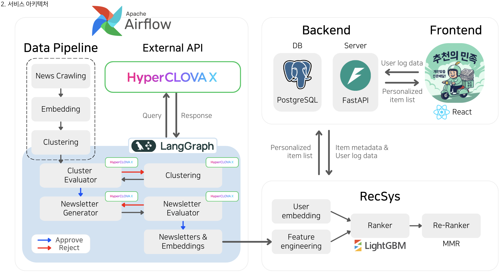

<p align="center">
  
</p>

<h1 align="center">📨 AI 개인화 뉴스레터 추천 시스템</h1>

<p align="center">
  <b>LLM + 클러스터링 + 추천시스템이 결합된 End-to-End 뉴스레터 자동 생성 플랫폼</b>
</p>

<p align="center">
  
  
  
  
  
  
</p>

---

## 🎯 프로젝트 개요

매일 쏟아지는 수백 개의 뉴스 기사를 **AI가 자동으로 분류·요약**하여, 사용자의 관심사에 맞춘 **개인화 뉴스레터**로 제공하는 서비스입니다.

### 💡 해결하는 문제
| 문제 | 솔루션 |
|------|--------|
| 📰 **정보 과부하** | 유사 기사를 클러스터링하여 핵심 내용만 요약 |
| 🔄 **중복 콘텐츠** | 같은 이슈를 다룬 여러 기사를 하나의 뉴스레터로 통합 |
| 🎯 **개인화 부재** | 클릭 이력 기반 임베딩으로 맞춤형 추천 |
| ⚖️ **편향 우려** | 다양한 언론사 조합으로 균형 잡힌 시각 제공 |

---

## ✨ 주요 기능

### 1. 🤖 LLM 기반 자동 뉴스레터 생성
- **LangGraph 워크플로우**: 평가-생성-재시도의 반복 루프로 품질 보장
- **2-Stage 생성**: 본문 생성 → 메타데이터(제목/요약) 생성
- **문체 변환**: 딱딱한 뉴스 → 친근한 대화체 + 이모지 🎉

### 2. 📊 지능형 클러스터링
- **HDBSCAN**: 밀도 기반 클러스터링으로 자동 주제 분류
- **품질 평가**: LLM이 클러스터 일관성 검증 및 아웃라이어 제거
- **Split 로직**: 혼합 주제 클러스터 자동 분리

### 3. 🎯 개인화 추천 시스템
- **LightGBM + MMR**: 클릭 확률 예측 + 다양성 확보 Reranking
- **사용자 임베딩**: 클릭 이력 + 선호 뉴스레터 기반 벡터 (Time Decay 적용)
- **Cold Start 대응**: 신규 유저를 위한 인기 뉴스레터 제공
- **평가 지표**: MRR, nDCG 자동 산출

---

## 🏗️ 시스템 아키텍처

<p align="center">
  
</p>

---

## 🛠️ 기술 스택

### AI Pipeline
| 기술 | 용도 |
|------|------|
| **LangGraph** | 상태 기반 워크플로우 오케스트레이션 |
| **BGE-M3** | 다국어 임베딩 (1024차원) |
| **HDBSCAN** | 밀도 기반 클러스터링 |
| **HyperCLOVA X** | 한국어 뉴스레터 생성 |
| **LightGBM** | 클릭 확률 예측 (Ranking) |
| **Trafilatura** | 웹 본문 추출 |

### Backend
| 기술 | 용도 |
|------|------|
| **FastAPI** | RESTful API 서버 |
| **PostgreSQL** | 관계형 데이터베이스 |
| **pgvector** | 벡터 유사도 검색 |
| **Alembic** | DB 마이그레이션 |
| **Apache Airflow** | DAG 기반 스케줄링 |

### Frontend
| 기술 | 용도 |
|------|------|
| **React** | UI 라이브러리 |
| **TypeScript** | 타입 안정성 |
| **Vite** | 빌드 도구 |
| **Tailwind CSS** | 스타일링 |
| **shadcn/ui** | 컴포넌트 라이브러리 |

---

## 📁 프로젝트 구조

```
pro-recsys-finalproject-recsys-01/
├── ai_workspace/              # 🤖 AI 파이프라인
│   ├── core/                  # 핵심 비즈니스 로직
│   │   ├── embedder.py        # BGE-M3 임베딩
│   │   ├── llm_client.py      # LLM API 클라이언트
│   │   ├── clustering/        # 클러스터링 모듈
│   │   └── reconstruction/    # 뉴스레터 생성
│   ├── workflow/              # LangGraph 워크플로우
│   ├── crawler/               # RSS 수집 & 본문 추출
│   ├── recommend_engine/      # 추천 시스템
│   └── pipeline/              # 스테이지 오케스트레이션
│
├── backend/                   # 🖥️ FastAPI 서버
│   ├── app/
│   │   ├── api/               # API 엔드포인트
│   │   ├── models/            # SQLAlchemy 모델
│   │   └── services/          # 비즈니스 로직
│   ├── airflow/               # DAG 정의
│   └── alembic/               # DB 마이그레이션
│
└── frontend/                  # 🎨 React 웹앱
    └── src/
        ├── components/        # UI 컴포넌트
        ├── pages/             # 페이지 컴포넌트
        ├── hooks/             # 커스텀 훅
        └── services/          # API 클라이언트
```

---

## 🚀 실행 방법

### 1. AI Pipeline 실행
```bash
cd ai_workspace

# 환경 설정
cp .env.example .env
pip install -r requirements.txt

# 파이프라인 실행 (전체)
python main.py

# 특정 스테이지만 실행
python main.py --from-stage 3 --to-stage 5
```

### 2. Backend 서버 실행
```bash
cd backend

# 환경 설정
pip install -r requirements.txt

# 서버 시작
uvicorn app.main:app --reload --port 8000
```

### 3. Frontend 실행
```bash
cd frontend

# 의존성 설치
npm install

# 개발 서버 시작
npm run dev
```

---

## 📊 성능 지표

| 항목 | 측정값 | 비고 |
|------|--------|------|
| 일일 처리 뉴스 | ~1000건 | 10개 언론사 RSS 기준 |
| 뉴스레터 생성 | ~100건/일 | 클러스터 품질 필터 통과 기준 |
| 추천 응답 시간 | < 100ms | pgvector 인덱스 활용 |
| 소스 다양성 | 56.4% | 평균 2.5개 언론사/뉴스레터 |

---

## 🤝 팀 소개

| 이름 | 담당 영역 | GitHub |
|------|-----------|--------|
| **김형준** | LangGraph, Clustering, 기획, 뉴스레터 제작, Crawling, ERD 설계, LLM, Prompt Engineering, Airflow | [@khj1212k](https://github.com/khj1212k) |
| **박소정** | Back-End, Airflow, DB 구축, ERD 설계, 기획 | [@sojeong0202](https://github.com/sojeong0202) |
| **성승우** | 추천모델, 기획 | [@sssseungu](https://github.com/sssseungu) |
| **이선진** | Front-End, Back-End, 기획, 합성 데이터셋 생성, DB 구축, ERD 설계, 프로토타입 구현 | [@Seonjin-13](https://github.com/Seonjin-13) |
| **이효창** | 기획, Crawling, Clustering, 뉴스레터 제작, LLM, Prompt Engineering | [@hochang2](https://github.com/hochang2) |

---

## 📄 라이선스

이 프로젝트는 교육 및 포트폴리오 목적으로 제작되었습니다.

---

<p align="center">
  <b>🌟 부스트캠프 AI Tech 8기 RecSys Track - Final Project 🌟</b>
</p>
