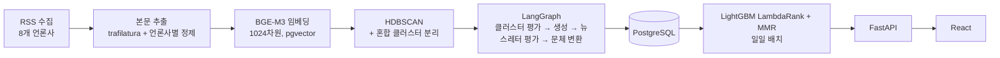

# AI 개인화 뉴스레터 추천 시스템

한국 언론사 RSS 기사를 모아 같은 사건끼리 묶고, LLM으로 사건별 뉴스레터를 쓰고, 사용자별로 순위를 매겨 보여 주는 파이프라인이다.

[](https://github.com/khj1212k/pro-recsys-finalproject-recsys-01/actions/workflows/ci.yml)

이 저장소는 네이버 부스트캠프 AI Tech 8기 RecSys 트랙 5인 팀 프로젝트(2026.01–02)의 fork다. 팀 프로젝트가 끝난 시점은 `team-final` 태그(`ef7c176`, 2026-02-10)이고, 그 뒤 커밋은 김형준([@khj1212k](https://github.com/khj1212k))의 개인 작업이다. 팀 시절 설명과 팀원별 담당은 [아래 절](#팀-프로젝트-시절-202601-02)에 원래 표 그대로 남겼다.

배포된 서비스가 아니다. 실사용자와 실사용 로그는 없다.

---

## 현재 상태 (2026-09-26, `main` 기준)



| 영역 | 지금 있는 것 | 아직 없는 것 |
|---|---|---|
| 수집 | RSS UPSERT, 재시도, 언론사별 본문 정제 | 수집량·실패율 리포트 |
| LLM | OpenAI 호환 어댑터 하나로 Gemini·Upstage·OpenAI 호출, 요청 타임아웃 60초·호출당 deadline 180초, 킬 스위치 ([ADR 0005](docs/adr/0005-llm-provider-abstraction.md)) | 모델 선정 근거(사전 등록 평가), `main`에서 실데이터로 끝까지 돈 생성 기록 |
| 생성 품질 | 결정론적 사실성 검사 함수(`evaluation/llm/faithfulness.py`), 클러스터링 지표 함수(`evaluation/clustering/metrics.py`) | 사람 라벨로 보정한 품질·사실성 수치 |
| 추천 | 팀 시절 LightGBM + MMR에 7월 셀프 리뷰 수정 반영 (시점 누출·그룹 정의·시드 등, [ADR 0003](docs/adr/0003-lightgbm-mmr-for-recommendation.md)·[0004](docs/adr/0004-continue-in-fork-and-port-july-fixes.md)) | 사람 클릭 데이터로 잰 추천 성능 |
| DB | pgvector 어댑터 등록, `news_raw` URL UNIQUE·timestamptz ([ADR 0008](docs/adr/0008-db-layer-pgvector-schema-and-upsert.md)) | — |
| 데이터 정책 | 출처별 라이선스 표와 본문 보존 원칙 ([ADR 0023](docs/adr/0023-data-sources-copyright-retention.md)) | 본문 보존 기한 잡(설계만, 구현은 수집 스키마 병합 후) |

LLM 호출은 HyperCLOVA X가 아니라 위 어댑터를 거친다. 팀 시절에 쓰던 HyperCLOVA X는 더 이상 쓸 수 없어서 교체했다([ADR 0005](docs/adr/0005-llm-provider-abstraction.md)).

## 측정한 것과 아직 측정하지 않은 것

측정했고 근거가 저장소에 있는 것:

- LLM 호출 프로브(2026-09-25, 각 1회): 생성 기본 모델은 정상 응답 1.8초, 판정 기본 모델은 8.1초. 한 후보는 30초 타임아웃과 연속 503이 나서 판정 기본값에서 뺐다 — [ADR 0005 부록](docs/adr/0005-llm-provider-abstraction.md). 표본이 1회씩이라 지연 분포로 읽으면 안 된다.
- 추론 시 사용자 히스토리 임베딩 메모이즈: 합성 데이터(사용자 300 × 뉴스 200)에서 수정 전 14.5~15.1초 → 수정 후 0.044~0.053초 — [ADR 0004](docs/adr/0004-continue-in-fork-and-port-july-fixes.md).
- 항상 0이던 사용자 속성 피처 2개 제거 전후 LightGBM 예측이 3시드 × 열 위치 3가지에서 비트 단위로 같음 — [ADR 0003](docs/adr/0003-lightgbm-mmr-for-recommendation.md).
- 단위 테스트와 pgvector 통합 테스트는 CI에서 매 푸시마다 돈다.

아직 측정하지 않은 것:

- 뉴스레터 품질·사실성, 클러스터링 품질(사람 라벨 필요), 추천 성능(사람 클릭 데이터 필요), API 응답 지연, 운영 비용.
- 평가 설계와 결과는 확정되는 대로 [`docs/adr/`](docs/adr/README.md)와 [`reports/`](reports/README.md)에 추가한다. README에는 리포트 파일에 있는 수치만 옮긴다.

철회한 것:

- 팀 시절 README의 추천 응답 시간·소스 다양성 수치는 산출 코드가 저장소에 없어 뺐다([fix-log #7](docs/fix-log-2026-07.md)).
- 팀 시절 추천 엔진 문서의 오프라인 지표는 쓰지 않는다. 클릭 로그가 LLM 페르소나로 만든 합성 데이터이고, 평가 스크립트의 정답 기간이 학습 구간과 겹쳤다(추론 시점 누출).

---

## 실행

### 테스트

`ai_workspace`와 `ai_workspace/recommend_engine`은 각각 `pyproject.toml`을 가진 설치 단위다.

```bash
uv venv --python 3.11 .venv
uv pip install --python .venv/bin/python -e "ai_workspace[test]" -e "ai_workspace/recommend_engine[test]"

# DB·네트워크·벤치마크를 빼고 실행 (CI의 test 잡과 같은 범위)
.venv/bin/python -m pytest -q -m "not integration and not benchmark"
```

통합 테스트(`-m integration`)는 pgvector가 있는 PostgreSQL이 필요하다. CI는 `pgvector/pgvector` 서비스 컨테이너로 돌린다(`.github/workflows/ci.yml`).

### AI 파이프라인

```bash
cd ai_workspace
cp .env.example .env          # GEMINI_API_KEY, DB 접속 정보 등
pip install -r requirements.txt
python main.py --from-stage 1 --to-stage 3   # 수집 → 본문 추출 → 임베딩
python main.py --from-stage 4 --to-stage 5   # 클러스터링 → 뉴스레터 생성 (LLM 비용 발생)
```

### 백엔드 · 프론트엔드

```bash
cd backend && pip install -r requirements.txt && uvicorn app.main:app --reload --port 8000
cd frontend && npm install && npm run dev
```

---

## 데이터와 저작권

- 언론사 기사 본문은 각 언론사의 저작물이다. 본문은 로컬 DB에서 처리에만 쓰고 저장소·리포트·데모에 싣지 않는다. 데모에는 제목, 언론사, 원문 링크, 우리가 생성한 뉴스레터만 보인다.
- 저장소와 리포트에는 기사 id, URL, 해시, 건수 같은 메타데이터만 남긴다.
- 공개해도 되는 평가용 부분집합은 공공누리 제1유형 출처(정책브리핑)로 만든다. 출처별 조건과 보존 기한은 [ADR 0023](docs/adr/0023-data-sources-copyright-retention.md)에 있다.

## 문서

- [설계 결정 기록(ADR)](docs/adr/README.md) — 컨텍스트, 검토한 대안, 결정, 증거, 한계.
- [2026-07 셀프 리뷰 수정 로그](docs/fix-log-2026-07.md)
- [평가 리포트](reports/README.md)
- [평가 모듈](evaluation/README.md)

---

## 팀 프로젝트 시절 (2026.01–02)

부스트캠프 AI Tech 8기 RecSys 트랙 최종 프로젝트. 아래는 팀 시절 설계를 요약한 것이고, 당시 수치 주장은 위 "철회한 것"에 따라 옮기지 않았다.

- LangGraph로 클러스터 평가 → 뉴스레터 생성 → 뉴스레터 평가를 재시도 루프로 묶고, 본문 생성과 메타데이터(제목·한줄 요약·키워드) 생성을 두 번의 호출로 나눴다. 마지막에 친근한 문체로 바꾸는 단계를 뒀다.
- HDBSCAN으로 기사를 묶고, LLM 평가로 클러스터 일관성을 확인해 이상치를 빼고, 주제가 섞인 클러스터는 둘로 나눴다.
- 클릭 이력 임베딩(시간 감쇠)과 온보딩 카테고리로 피처를 만들어 LightGBM으로 순위를 매기고 MMR로 다양성을 섞었다. 신규 사용자에게는 인기 뉴스레터를 보여 줬다.
- Airflow DAG로 수집과 추천 배치를 돌렸다.

팀 시절 아키텍처 (당시 LLM은 HyperCLOVA X — 지금은 쓰지 않는다):

<p align="center">
  
</p>

### 팀 소개

| 이름 | 담당 영역 | GitHub |
|------|-----------|--------|
| **김형준** | LangGraph, Clustering, 기획, 뉴스레터 제작, Crawling, ERD 설계, LLM, Prompt Engineering, Airflow | [@khj1212k](https://github.com/khj1212k) |
| **박소정** | Back-End, Airflow, DB 구축, ERD 설계, 기획 | [@sojeong0202](https://github.com/sojeong0202) |
| **성승우** | 추천모델, 기획 | [@sssseungu](https://github.com/sssseungu) |
| **이선진** | Front-End, Back-End, 기획, 합성 데이터셋 생성, DB 구축, ERD 설계, 프로토타입 구현 | [@Seonjin-13](https://github.com/Seonjin-13) |
| **이효창** | 기획, Crawling, Clustering, 뉴스레터 제작, LLM, Prompt Engineering | [@hochang2](https://github.com/hochang2) |

---

## 라이선스

교육 및 포트폴리오 목적의 저장소다. 수집한 기사 본문은 저장소에 포함하지 않는다.
