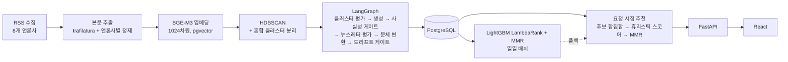
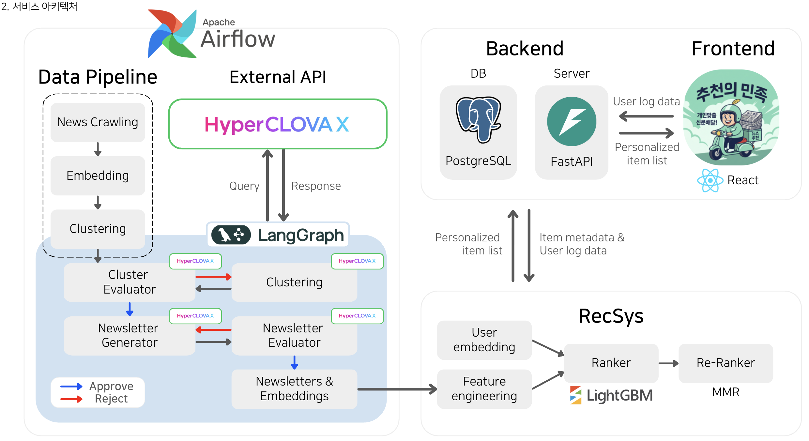

# AI 개인화 뉴스레터 추천 시스템

한국 언론사 RSS 기사를 모아 같은 사건끼리 묶고, LLM으로 사건별 뉴스레터를 쓰고, 사용자별로 순위를 매겨 보여 주는 파이프라인이다.

[](https://github.com/khj1212k/pro-recsys-finalproject-recsys-01/actions/workflows/ci.yml)

이 저장소는 네이버 부스트캠프 AI Tech 8기 RecSys 트랙 5인 팀 프로젝트(2026.01–02)의 fork다. 팀 프로젝트가 끝난 시점은 `team-final` 태그(`ef7c176`, 2026-02-10)이고, 그 뒤 커밋은 김형준([@khj1212k](https://github.com/khj1212k))의 개인 작업이다. 팀 시절 설명과 팀원별 담당은 [아래 절](#팀-프로젝트-시절-202601-02)에 원래 표 그대로 남겼다.

배포된 서비스가 아니다. 실사용자와 실사용 로그는 없다.

---

## 현재 상태 (2026-10-06 기준)


```mermaid
flowchart LR
    A[RSS 수집<br/>8개 언론사] --> B[본문 추출<br/>trafilatura + 언론사별 정제]
    B --> C[BGE-M3 임베딩<br/>1024차원, pgvector]
    C --> D[HDBSCAN<br/>+ 혼합 클러스터 분리]
    D --> E[LangGraph<br/>클러스터 평가 → 생성 → 사실성 게이트<br/>→ 뉴스레터 평가 → 문체 변환 → 드리프트 게이트]
    E --> F[(PostgreSQL)]
    F --> G[LightGBM LambdaRank + MMR<br/>일일 배치]
    F --> R[요청 시점 추천<br/>후보 합집합 → 휴리스틱 스코어 → MMR]
    G -. 폴백 .-> R
    R --> H[FastAPI] --> I[React]
```

그림은 코드에 있는 경로다. compose 스케줄러가 지금 돌리는 잡은 수집, 임베딩, 인기도, 클러스터 통계, 일일 리포트다. `generate`, `batch_fallback` 잡은 `docker/crontab`에서 꺼져 있다. 팀 시절의 학습 잡 `train`은 은퇴했고(불려도 아무것도 실행하지 않는다) `user_embed` 잡은 없앴다 - 장기 프로필은 클릭마다 갱신되는 상태다 ([ADR 0033](docs/adr/0033-train-serve-feature-parity.md)).

| 영역 | 지금 있는 것 | 아직 없는 것 |
|---|---|---|
| 수집 | RSS UPSERT, 재시도, 언론사별 본문 정제, docker compose + supercronic 잡 런타임과 실행 기록(`job_runs`), 본문 해시 중복 제거 ([ADR 0006](docs/adr/0006-runtime-compose-and-scheduler.md)), 정책브리핑 Open API 수집기 ([ADR 0023](docs/adr/0023-data-sources-copyright-retention.md)) | 7일 연속 수집 성공률(ADR 0006에서 재확인 예정), 정책브리핑 실제 수집(인증키 발급 전이라 0건) |
| LLM | OpenAI 호환 어댑터 하나로 Gemini·Upstage·OpenAI 호출, 요청 타임아웃 60초·호출당 deadline 180초, 킬 스위치 ([ADR 0005](docs/adr/0005-llm-provider-abstraction.md)), 요청 전에 최악 비용을 원장에 예약해 런·일·전체 상한에서 멈추는 지출 가드와 런 서킷브레이커 ([ADR 0035](docs/adr/0035-llm-spend-cap-in-client-ledger.md), 페이크 전송 계층 테스트로만 확인) | 원장 금액과 실제 청구액의 대조(실제 호출 전), 모델 선정 결과(평가 프로토콜과 선정 규칙만 사전 등록, [ADR 0009](docs/adr/0009-llm-eval-protocol-and-preregistered-decision-rule.md)), `main`에서 실데이터로 끝까지 돈 생성 기록 |
| 생성 품질 | LangGraph 안의 결정론적 사실성 게이트·문체 드리프트 게이트와 judge v2 (`ai_workspace/core/faithfulness.py`, [ADR 0010](docs/adr/0010-faithfulness-gate-and-judge-v2.md), 차단 유형·임계값은 잠정값), 클러스터링 지표 함수(`evaluation/clustering/metrics.py`) | 사람 라벨로 보정한 품질·사실성 수치, 실제 생성물로 잰 게이트 차단율 |
| 추천(배치) | 팀 시절 LightGBM + MMR에 7월 셀프 리뷰 수정 반영 (시점 누출·그룹 정의·시드 등, [ADR 0003](docs/adr/0003-lightgbm-mmr-for-recommendation.md)·[0004](docs/adr/0004-continue-in-fork-and-port-july-fixes.md)) | 이 서비스의 사람 클릭으로 잰 추천 성능(실사용자가 없다) |
| 추천(요청 시점) | `GET /newsletters/today`를 API 프로세스 안에서 요청마다 계산한다. 후보 합집합 → 휴리스틱 스코어 → MMR, 시간 예산 300ms, 폴백(인기 → 최신. `RECSYS_MODE=batch`에서는 배치 행부터), 노출 로그 ([ADR 0015](docs/adr/0015-request-time-recommendation.md)). 단기 사용자 상태는 클릭 로그에서 요청마다 계산한다 ([ADR 0017](docs/adr/0017-short-term-state-store.md)). 랭커의 피처는 오프라인 하네스와 같은 코드(`recsys_core`)로 요청 시점에 만들고, 레지스트리에 등록된 모델은 요청 경로 밖에서 점수만 남긴다(shadow). 서빙이 남긴 피처가 같은 로그의 오프라인 재계산과 같은지는 CI가 요청 200건의 재생으로 본다 ([ADR 0033](docs/adr/0033-train-serve-feature-parity.md), [리포트](reports/recsys/parity_v1.md)) | 추천 품질, 배포 대상 장비와 HTTP 수준의 지연, 실제 임베딩으로 정한 휴리스틱 가중치. 등록된 랭커 모델이 아직 없다(목록은 휴리스틱이 만든다). parity 게이트가 쓰는 모델은 무작위 데이터로 만든 22열 모델이다 |
| 추천 평가 | 팀 베이스라인 재현 하네스와 오프라인 평가 프로토콜(point-in-time, 고정 정답 창, 베이스라인, 시드와 부트스트랩 신뢰구간, [ADR 0007](docs/adr/0007-recsys-offline-evaluation-protocol.md)). EB-NeRD 공개 벤치마크 하네스, point-in-time 피처 코어 `recsys_core`, ranker v2 설계와 사전 등록한 승격 규칙 ([ADR 0013](docs/adr/0013-ranker-v2-design.md)) | 한국어 데이터에서의 ranker v2 검증(서빙은 shadow부터), 팀 재현 리포트의 전체 재실행(재실행 대기) |
| 시뮬레이터·부하 | 합성 사용자 시뮬레이터, Locust 부하 하네스, 사전 등록한 지표 타당성 격자 ([ADR 0019](docs/adr/0019-user-simulator-design-and-claim-scope.md)). 시스템 반응 지표만 보고 추천 정확도는 주장하지 않는다 | 부하 수치(재실행 대기), drift 적응 지표의 타당성 |
| DB | pgvector 어댑터 등록, `news_raw` URL UNIQUE·timestamptz ([ADR 0008](docs/adr/0008-db-layer-pgvector-schema-and-upsert.md)), 노출 로그·모델 레지스트리 테이블과 요청 경로 인덱스 (ADR 0015) | — |
| 데이터 정책 | 출처별 라이선스 표와 본문 보존 원칙 ([ADR 0023](docs/adr/0023-data-sources-copyright-retention.md)) | 본문 보존 기한 잡(설계만, 미구현) |

LLM 호출은 HyperCLOVA X가 아니라 위 어댑터를 거친다. 팀 시절에 쓰던 HyperCLOVA X는 더 이상 쓸 수 없어서 교체했다([ADR 0005](docs/adr/0005-llm-provider-abstraction.md)).

## 측정한 것과 아직 측정하지 않은 것

측정했고 근거가 저장소에 있는 것:

- LLM 호출 프로브(2026-09-25, 각 1회): 생성 기본 모델은 정상 응답 1.8초, 판정 기본 모델은 8.1초. 한 후보는 30초 타임아웃과 연속 503이 나서 판정 기본값에서 뺐다 — [ADR 0005 부록](docs/adr/0005-llm-provider-abstraction.md). 표본이 1회씩이라 지연 분포로 읽으면 안 된다.
- 추론 시 사용자 히스토리 임베딩 메모이즈: 합성 데이터(사용자 300 × 뉴스 200)에서 수정 전 14.5~15.1초 → 수정 후 0.044~0.053초 — [ADR 0004](docs/adr/0004-continue-in-fork-and-port-july-fixes.md).
- 항상 0이던 사용자 속성 피처 2개 제거 전후 LightGBM 예측이 합성 데이터에서 비트 단위로 같음. 3시드 × 열 위치 3가지 × 학습 방식 2가지(early stopping, 트리 300개 고정) — [reports/recsys/constant_feature_ablation_v1](reports/recsys/constant_feature_ablation_v1.md), [ADR 0003](docs/adr/0003-lightgbm-mmr-for-recommendation.md).
- 팀 베이스라인 재현(팀이 남긴 합성 클릭 아카이브, 평가 유저 31명, 시드 5개): 같은 모델을 팀 방식 추론 시점과 point-in-time으로 추론하면 팀 최종 코드의 MRR이 0.8485 → 0.5636이 된다(차이 +0.2849, 95% CI [+0.1581, +0.4177]). point-in-time에서 인기도·온보딩 코사인·히스토리 코사인 베이스라인에 대한 모델 우위 신뢰구간은 없다. 절대 수치는 성능이 아니라 코드 결함이 지표를 움직이는 방향을 보는 진단이다 — [reports/recsys/team_repro_v2](reports/recsys/team_repro_v2.md), [ADR 0007](docs/adr/0007-recsys-offline-evaluation-protocol.md).
- [EB-NeRD] 덴마크어 공개 뉴스 클릭 로그(`ebnerd_small`) 오프라인 평가: 노출 재정렬 nDCG@10이 ranker v2 0.6551 [0.6533, 0.6569], 가장 강한 베이스라인 popularity_24h 0.5992, 팀 방식 재현 0.3952다. 이 서비스의 성능이 아니다 — [reports/recsys/ebnerd_v1](reports/recsys/ebnerd_v1.md), [ADR 0013](docs/adr/0013-ranker-v2-design.md).
- 요청 시점 추천의 요청 경로 지연: 합성 데이터를 GitHub 호스티드 러너에서 쟀고 HTTP 처리는 들어 있지 않다. 조건과 결과 JSON은 [reports/serving](reports/serving/README.md), 해석은 ADR 0015·0017에 있다.
- [SIM] 시뮬레이터 지표 타당성 격자 v1: 사전 등록한 판정 50건 중 위반 2건(둘 다 drift 적응 지표), 보고만 하는 항목 8건. 추천 정확도 수치가 아니다 — [reports/sim/grid_v1](reports/sim/grid_v1.md), [ADR 0019](docs/adr/0019-user-simulator-design-and-claim-scope.md).
- 단위 테스트와 pgvector 통합 테스트는 CI에서 매 푸시마다 돈다.

아직 측정하지 않은 것:

- 뉴스레터 품질·사실성, 클러스터링 품질(사람 라벨 필요), 이 서비스의 사람 클릭으로 잰 추천 성능, 배포 대상 장비와 HTTP 수준의 API 응답 지연, 부하 테스트 수치, 운영 비용.
- 노트북에서 돌리지 않고 미뤄 둔 재실행은 각 ADR의 한계 절에 "재실행 대기"로 명령과 함께 적혀 있다(ADR 0007, 0013, 0015, 0019).
- 평가 설계와 결과는 확정되는 대로 [`docs/adr/`](docs/adr/README.md)와 [`reports/`](reports/README.md)에 추가한다. README의 수치는 `reports/`의 파일에서만 옮긴다. 위 목록의 처음 두 항목(LLM 호출 프로브, 메모이즈)만 리포트 파일 없이 ADR을 근거로 둔 예외다.

철회한 것:

- 팀 시절 README의 추천 응답 시간·소스 다양성 수치는 산출 코드가 저장소에 없어 뺐다([fix-log #7](docs/fix-log-2026-07.md)).
- 팀 시절 추천 엔진 문서의 오프라인 지표는 쓰지 않는다. 클릭 로그가 LLM 페르소나로 만든 합성 데이터이고, 평가 스크립트의 정답 기간이 학습 구간과 겹쳤다(추론 시점 누출). 재현 결과는 [reports/recsys/team_repro_v2](reports/recsys/team_repro_v2.md)에 있고, 팀 보고값은 그 재현으로 설명되지 않았다.

---

## 실행

### 테스트

`ai_workspace`와 `ai_workspace/recommend_engine`은 각각 `pyproject.toml`을 가진 설치 단위다.

설치 순서와 목록은 `.github/workflows/ci.yml`의 `test` 잡이 기준이다. 아래는 그 잡을 옮긴 것이다.

```bash
uv venv --python 3.11 .venv
PY=.venv/bin/python

# 1) 평가 고정 버전 + 테스트 공통 의존성
uv pip install --python $PY -r evaluation/requirements.txt \
  pytest langgraph langchain-openai openai tiktoken numpy pandas scikit-learn lightgbm optuna \
  pgvector psycopg2-binary python-dotenv sqlalchemy sqlmodel alembic feedparser requests \
  python-dateutil trafilatura tqdm pyyaml lxml_html_clean pydantic "kiwipiepy==0.23.2" hdbscan rapidfuzz
# 2) API 라우터 테스트용 백엔드 고정 버전
uv pip install --python $PY "fastapi==0.117.1" httpx "python-jose==3.5.0" "passlib==1.7.4" "bcrypt==3.2.2"
# 3) 두 설치 단위 (의존성은 위에서 넣었으므로 --no-deps)
uv pip install --python $PY --no-deps -e ai_workspace
uv pip install --python $PY --no-deps -e ai_workspace/recommend_engine
# 4) 시뮬레이터 테스트
uv pip install --python $PY locust uvicorn

# DB·네트워크·벤치마크를 빼고 실행 (CI의 test 잡과 같은 범위)
$PY -m pytest -q -m "not integration and not benchmark" tests/
```

`ai_workspace[test]`와 `recommend_engine[test]`만 설치하면 API 라우터 테스트가 fastapi를 찾지 못해 수집 단계에서 멈춘다.

통합 테스트(`-m integration`)는 pgvector가 있는 PostgreSQL이 필요하다. CI는 `pgvector/pgvector` 서비스 컨테이너로 돌린다(`.github/workflows/ci.yml`).

### AI 파이프라인

```bash
cd ai_workspace
cp .env.example .env          # GEMINI_API_KEY, DB 접속 정보 등
pip install -r requirements.txt
python main.py --from-stage 1 --to-stage 3   # 수집 → 본문 추출 → 임베딩
python main.py --from-stage 4 --to-stage 5   # 클러스터링 → 뉴스레터 생성 (LLM 비용 발생)
```

### 백엔드 · 프론트엔드

```bash
cd backend && pip install -r requirements.txt && uvicorn app.main:app --reload --port 8000
cd frontend && npm install && npm run dev
```

---

## 데이터와 저작권

- 언론사 기사 본문은 각 언론사의 저작물이다. 본문은 로컬 DB에서 처리에만 쓰고 저장소·리포트·데모에 싣지 않는다. 데모에서 보여 주는 범위는 기사 제목, 언론사, 원문 링크, 생성한 뉴스레터까지다(현재 API는 기사 본문을 내보내지 않는다).
- 저장소와 리포트에는 기사 id, URL, 해시, 건수 같은 메타데이터만 남긴다.
- 공개해도 되는 평가용 부분집합은 공공누리 제1유형 출처(정책브리핑)로 만든다. 출처별 조건과 보존 기한은 [ADR 0023](docs/adr/0023-data-sources-copyright-retention.md)에 있다.

## 문서

- [설계 결정 기록(ADR)](docs/adr/README.md) — 컨텍스트, 검토한 대안, 결정, 증거, 한계.
- [설계 문서](docs/design/README.md) — ADR로 옮기기 전 단계의 아키텍처 리뷰와 추천·LLM 생성 v2 설계 사양(2026-09-26). 문서마다 지금 상태를 적어 두었고, 효력이 있는 것은 ADR이다.
- [2026-07 셀프 리뷰 수정 로그](docs/fix-log-2026-07.md)
- [운영 런북](docs/runbook.md) — compose 잡 런타임 띄우기, 상태 확인, 킬 스위치.
- [평가 리포트](reports/README.md)
- [평가 모듈](evaluation/README.md)
- [사용자 시뮬레이터와 부하 하네스](sim/README.md)

---

## 팀 프로젝트 시절 (2026.01–02)

부스트캠프 AI Tech 8기 RecSys 트랙 최종 프로젝트. 아래는 팀 시절 설계를 요약한 것이고, 당시 수치 주장은 위 "철회한 것"에 따라 옮기지 않았다.

- LangGraph로 클러스터 평가 → 뉴스레터 생성 → 뉴스레터 평가를 재시도 루프로 묶고, 본문 생성과 메타데이터(제목·한줄 요약·키워드) 생성을 두 번의 호출로 나눴다. 마지막에 친근한 문체로 바꾸는 단계를 뒀다.
- HDBSCAN으로 기사를 묶고, LLM 평가로 클러스터 일관성을 확인해 이상치를 빼고, 주제가 섞인 클러스터는 둘로 나눴다.
- 클릭 이력 임베딩(시간 감쇠)과 온보딩 카테고리로 피처를 만들어 LightGBM으로 순위를 매기고 MMR로 다양성을 섞었다. 신규 사용자에게는 인기 뉴스레터를 보여 줬다.
- Airflow DAG로 수집과 추천 배치를 돌렸다.

팀 시절 아키텍처 (당시 LLM은 HyperCLOVA X — 지금은 쓰지 않는다):

<p align="center">
  
</p>

### 팀 소개

| 이름 | 담당 영역 | GitHub |
|------|-----------|--------|
| **김형준** | LangGraph, Clustering, 기획, 뉴스레터 제작, Crawling, ERD 설계, LLM, Prompt Engineering, Airflow | [@khj1212k](https://github.com/khj1212k) |
| **박소정** | Back-End, Airflow, DB 구축, ERD 설계, 기획 | [@sojeong0202](https://github.com/sojeong0202) |
| **성승우** | 추천모델, 기획 | [@sssseungu](https://github.com/sssseungu) |
| **이선진** | Front-End, Back-End, 기획, 합성 데이터셋 생성, DB 구축, ERD 설계, 프로토타입 구현 | [@Seonjin-13](https://github.com/Seonjin-13) |
| **이효창** | 기획, Crawling, Clustering, 뉴스레터 제작, LLM, Prompt Engineering | [@hochang2](https://github.com/hochang2) |

---

## 라이선스

교육 및 포트폴리오 목적의 저장소다. 수집한 기사 본문은 저장소에 포함하지 않는다.
