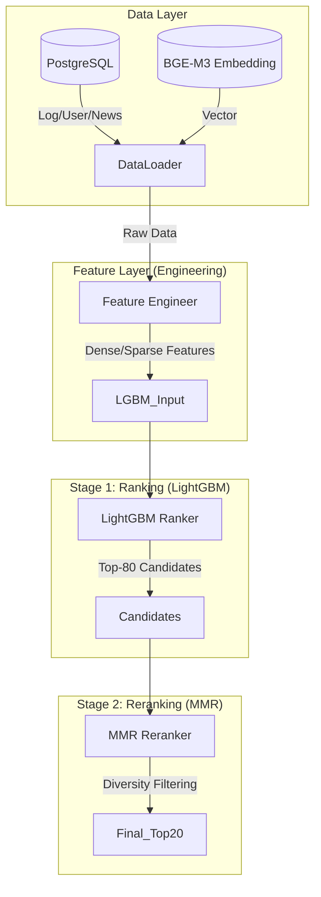

# 🏗️ System Architecture & Logic Detail

> **버전:** 0.4.0
> **작성일:** 2026-02-02
> **기술 스택:** Python, LightGBM, PostgreSQL, NumPy, Pandas

이 문서는 뉴스레터 추천 시스템의 내부 동작 원리, 데이터 파이프라인, 그리고 모델링 전략을 상세히 기술합니다.

---

## 1. 아키텍처 오버뷰 (The Big Picture)

우리의 시스템은 **2-Stage Recommendation Pipeline**을 따릅니다.
수많은 뉴스 중에서 후보를 추리고(Retrieval/Ranking), 그 중에서 최적의 조합을 재배열(Ordering/Reranking)하는 구조입니다.

---

## 2. 핵심 전략: Why LightGBM?

초기에는 Two-Tower(Deep Learning) 모델을 고려했으나, **User 100명 / Daily News 200건**이라는 "Small Data" 환경에서는 딥러닝 모델이 과적합(Overfitting) 되기 쉽다는 한계가 있었습니다.

이에 따라 우리는 **"Feature Engineering 기반의 GBDT(LightGBM)"** 방식으로 전환했습니다.
- **장점:** 적은 데이터로도 높은 성능, 빠른 학습/추론 속도, 피처 중요도(Feature Importance) 해석 가능.
- **전략:** 딥러닝이 스스로 학습하지 못하는 패턴(최신성, 유사도 등)을 사람이 직접 수치화하여 입력값으로 넣어줍니다.

---

## 3. Feature Engineering 상세

모델의 성능을 좌우하는 핵심 피처들입니다. (`src/features/feature_engineer.py`)

| 카테고리 | 피처 이름 | 데이터 타입 | 설명 및 의도 |
| :--- | :--- | :--- | :--- |
| **최신성** (Recency) | `hours_since_published` | Float | 뉴스 발행 후 경과 시간. **시간이 지날수록 클릭 확률이 낮아짐**을 모델이 학습하도록 유도합니다. |
| | `is_fresh_24h` | Binary | 24시간 이내 발행된 '따끈따끈한' 뉴스인지 여부. |
| **유사도** (Similarity) | `history_cosine_similarity` | Float | **(Core)** 유저가 과거에 읽은 뉴스들의 평균 벡터와 타겟 뉴스 벡터 간의 **Cosine Similarity**. 유저의 취향과 얼마나 가까운지를 나타냅니다. |
| **관심사** (Explicit) | `category_match_count` | Int | 유저가 가입 시 선택한 관심 카테고리(예: 경제, IT)와 뉴스의 카테고리가 몇 개나 일치하는지. |
| | `is_category_match` | Binary | 하나라도 일치하면 1, 아니면 0. |
| **유저 속성** | `user_age_band` | Categorical | 연령대 (10대~60대). 연령별 뉴스 소비 패턴 반영. |

---

## 4. Stage 1: Candidate Generation (Ranking)

LightGBM을 사용하여 모든 뉴스레터에 대해 **CTR(Click-Through Rate)**을 예측합니다.

- **학습 목표 (Objective):** Binary Classification (1: 클릭, 0: 미클릭)
- **Negative Sampling Strategy:**
    - 클릭 로그(Positive)는 DB에 존재하지만, "클릭하지 않은 로그(Negative)"는 없습니다.
    - 학습 시, **Positive 1개당 랜덤한 Negative 5개**를 생성하여 모델이 "무엇을 좋아하지 않는지"도 학습시킵니다.
    - *Ratio:* 1 : 5

---

## 5. Stage 2: Diversity Reranking (MMR)

LightGBM 점수만으로 상위 20개를 자르면, 점수가 높은 특정 카테고리(예: 경제 뉴스)만 도배되는 **Filter Bubble** 현상이 발생합니다. 이를 해결하기 위해 MMR 알고리즘을 적용합니다.

### 5.1 MMR 공식
$$ MMR = \lambda \cdot \text{Score}(i) - (1-\lambda) \cdot \max_{j \in S} \text{Sim}(i, j) $$

- $\text{Score}(i)$: LightGBM이 예측한 아이템 $i$의 점수 (관련성)
- $\text{Sim}(i, j)$: 이미 선택된 아이템 집합 $S$ 내의 아이템 $j$와 후보 아이템 $i$ 간의 임베딩 유사도 (다양성 패널티)
- $\lambda$: 관련성과 다양성 사이의 균형 파라미터 ($0 \le \lambda \le 1$)

### 5.2 Adaptive Lambda (적응형 파라미터)
모든 유저에게 같은 $\lambda$를 쓰지 않고, 유저 성향에 따라 동적으로 조절합니다.

- **관심사가 좁은 유저 (카테고리 1~2개):** $\lambda = 0.8$
    - 다양성보다는 본인이 좋아하는 주제를 깊게 보여줍니다.
- **관심사가 넓은 유저 (카테고리 5개 이상):** $\lambda = 0.6$
    - 다양한 주제를 골고루 섞어서 보여줍니다.

---

## 6. Cold Start 대응 전략

개인화 추천이 불가능한 상황에 대한 Fallback 로직입니다.

**신규 뉴스 (Item Cold Start):**
    - 로그가 없어도 `is_fresh` 등 메타 데이터 피처를 통해 추천 가능.
    - 시스템은 기본적으로 최신 뉴스에 가산점을 주도록 설계됨.

---

## 7. 데이터 파이프라인 요약

1.  **수집:** 17:00 크롤링 완료 -> DB 적재.
2.  **전처리:** `main_lgbm.py --inference` 실행.
    - DB에서 데이터 로드.
    - Feature Vector 생성.
3.  **랭킹:** LightGBM으로 전체 뉴스 스코어링 -> 상위 80개 추출.
4.  **리랭킹:** MMR로 최종 20개 선별.
5.  **적재:** `scripts/upload_to_db.py`로 서비스 DB `User_Preferred_Newsletter` 테이블에 Insert.