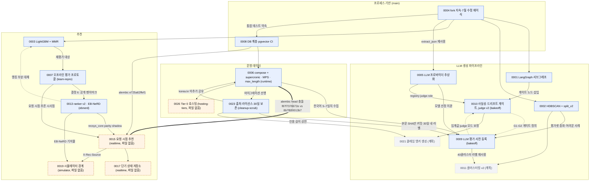

# 결정 지도(Decision Map)와 ADR 품질 감사

- 스냅샷: 2026-09-26. `main` = `9aa235e`(오늘 이력 재작성 후). 인플라이트 브랜치는 이 시각의 `origin/<branch>` tip을 읽었다
  (표 1의 SHA). 몇 개 브랜치는 지금도 편집 중이라 이 문서의 서술은 그 SHA 기준이다.
- 방법: `git ls-tree`/`git show origin/<branch>:docs/adr/...`로 모든 브랜치의 ADR 파일을 모으고, `git grep`으로 코드·문서의
  `ADR 00NN` 참조를 세고, ADR이 인용하는 리포트(`reports/**`)와 두 차례의 어드버서리얼 리뷰 결과를 대조했다.
- 이 문서는 **다른 브랜치의 ADR을 고치지 않는다.** 6절에 브랜치별로 "무엇을 고쳐야 하는지"만 적는다.
- 증거 라벨: `[synthetic team data]` 팀 아카이브 합성 로그(100 페르소나), `[EB-NeRD]` 덴마크어 공개 벤치마크,
  `[KR-ops]` 한국어 수집 런타임 실측(Mac M2), `[팀 아카이브 뉴스레터]` 팀이 생성한 뉴스레터 401편에 대한 합성 변형,
  `[SIM]` 시뮬레이터, `[LOAD]` 부하 테스트, `[KR-eval]` 한국어 사람 라벨 평가. **이 스냅샷에 `[SIM]`·`[LOAD]`·`[KR-eval]` 수치는
  하나도 없다** — 해당 브랜치에 `reports/` 파일이 없다.

## 1. ADR 인벤토리

### 표 1. 존재하는 ADR 파일 (12건, 6개 위치)

| 번호 | 제목(요약) | 상태(문서 자체 표기) | 파일이 있는 브랜치 · tip | 커밋 날짜 | 이력서 축 |
|---|---|---|---|---|---|
| 0001 | 뉴스레터 생성 워크플로우에 LangGraph | 채택됨 | `main` (모든 브랜치) | 2026-09-25 이식(원 결정 2026-07) | LLM |
| 0002 | 뉴스 클러스터링에 HDBSCAN + split_v2 2차 분할 | 채택됨 | `main` | 2026-09-25 이식(원 결정 2026-07) | LLM·recsys(데이터) |
| 0003 | 추천에 LightGBM(LambdaRank) + MMR | 채택됨(2026-07 갱신) — `eval/ebnerd-harness`에서만 "랭킹 부분은 0013이 대체" 추가 | `main` | 2026-09-25 이식(원 결정 2026-07) | recsys |
| 0004 | 기존 fork에서 계속, 7월 수정 26건 재이식 | 채택됨 | `main` | 2026-09-25 | MLOps(프로세스) |
| 0005 | OpenAI 호환 어댑터 하나로 LLM 프로바이더 통합 | 채택됨(모델 선정은 0009로 이관) | `main` | 2026-09-25(부록 PR #6) | LLM |
| 0006 | 런타임: docker compose + supercronic, Mac은 호스트 MPS 임베딩, max_length 8192 유지 | 채택됨(7일 수집 성공률로 재확인 예정) | `feat/runtime-compose-and-collection` `1f44fc9` | 2026-09-26 (`a8a6e95`) | MLOps |
| 0007 | 추천 시스템 오프라인 평가 프로토콜(point-in-time) | 채택됨 | `eval/team-baseline-repro-v1` `1585ce6` | 2026-09-25 (`65d3035`) | recsys |
| 0008 | pgvector 어댑터 등록, news_raw UNIQUE·timestamptz, RSS UPSERT, PostgreSQL CI | 채택됨 | `main` | 2026-09-25 | MLOps |
| 0009 | LLM 평가 프로토콜과 사전 등록 모델 선정 규칙(bake-off v1) | 채택됨(사전 등록, 결과 없음) + Addendum A1–A6 | `eval/llm-bakeoff-and-gate` `94255de` | 2026-09-25 (`aa06be8`), A1–A6 09-26 | LLM |
| 0010 | 결정론적 사실성 게이트, 문체 드리프트 게이트, judge v2(shadow) | 채택됨(임계값·모드 잠정) | `eval/llm-bakeoff-and-gate` `94255de` | 2026-09-26 (`d143ce6`) | LLM |
| 0013 | ranker v2 설계 — EB-NeRD 벤치마크 프로토콜과 승격 규칙 | 채택됨(R1–R4 통과, 서빙은 shadow) + A1(v1.1 사전 등록) | `eval/ebnerd-harness` `2d223a5` | 2026-09-26 (사전 등록 `d27a700` → 결과 `6421342` → A1 `2d223a5`) | recsys |
| 0023 | 수집 출처·라이선스, 저장·노출·공개 범위, 본문 30일 보존 | 채택됨(보존 잡은 수집 스키마 병합 후 구현) | `fix/cleanup-and-claim-scrub` `6e63733` | 2026-09-26 | MLOps(데이터 거버넌스) |

`main`의 `docs/adr/README.md`는 0001–0005·0008 6건만 안다. 0006/0007/0009/0010/0013/0023은 각자 브랜치의 README에만 행이 있다.

### 표 2. 결정 · 대안 · 증거 상태 · 효과

"증거 상태"의 세 값: **측정**(경로 있음) / **사전 등록·대기**(규칙은 커밋, 결과 없음) / **없음**.

| 번호 | 결정(한 줄) | 검토한 대안 | 증거 상태 | 무엇을 가능하게 하나 |
|---|---|---|---|---|
| 0001 | 단일 클러스터의 "평가→생성→평가→재시도" 서브그래프만 LangGraph로 두고, 클러스터 순회는 `pipeline/stages.py`가 맡는다 | if/for 스크립트, Celery, LangGraph(채택). **스코프 결정(서브그래프만)에는 대안 미기재** | 없음(정확도·비용 측정 없음). 재시도 상한 버그의 그래프 레벨 테스트 6건(`tests/test_cluster_eval_retry_graph.py`, ADR 0004 증거) | 0010이 같은 그래프에 게이트 노드 3개를 끼워 넣을 수 있는 구조. 0005 e2e 테스트의 골격 |
| 0002 | 1차 HDBSCAN + 2차 `split_v2`(KMeans 2-way·silhouette·Kiwi 개체명 Jaccard·중복 제목, VETO→FORCE→가중치) | K-means, DBSCAN, HDBSCAN(채택). **split_v2 설계와 임계값(`VETO_JACCARD_TH=0.55` 등)에는 대안·EDA 없음** | 없음(클러스터 품질 지표 없음). 첫 운영 실행 통계만: 기사 558건 → 클러스터 42개, 노이즈 비율 0.64 `[KR-ops]`(ADR 0006 증거 7) | 0009 평가셋의 층(크기×카테고리×split_v2 여부)과 "어려운 사례" 정의. 계획 ADR 0011(클러스터링 v2)의 출발점 |
| 0003 | `LGBMRanker`(binary→lambdarank, 유저 그룹) + 카테고리 수 적응형 λ MMR(0.8/0.7/0.6) | 코사인만, Two-Tower/Wide&Deep, LightGBM(채택); 쿼터 vs MMR(채택). **적응형 λ 구간값에는 대안·데이터 근거 없음**(문서 스스로 인정) | 팀 시절 수치는 인용 불가(아래 4.4). 재평가 `[synthetic team data]`: point-in-time MRR 0.5741 ± 0.0582(current), P@5 0.3398 < popularity 0.4839 (`reports/recsys/team_repro_v2.md` §2-1·§3-1, n=31 유저, 3 seed). `[EB-NeRD]`: binary→lambdarank(유저 그룹) ΔnDCG@10 +0.0010 (`reports/recsys/ebnerd_v1.md` §3) | 0007(재평가 대상), 0013(ablation 시작 arm `team_binary`), MMR 구현은 0013·0015가 그대로 재사용(성승우 작성) |
| 0004 | 기존 fork `main`에 주제별 PR로 계속; 7월 스냅샷을 항목별로 재이식하며 4건(#4·#5·#8·#16) 교정; DB 비밀번호 이력은 폐기 값이라 유지 | 새 저장소 / fork 유지(채택) / upstream PR; 스냅샷 일괄 병합 / 항목별 재이식(채택); filter-repo / 유지(채택) | 측정: `pytest -q` 89개 통과, #4 메모이즈 285–331배(14.48–15.12s → 0.044–0.053s, 300 유저×200 뉴스 합성, 로컬 M2) — `docs/adr/0004` 증거 절 | `team-final` 이후 커밋 = 본인 작업이라는 기여 경계. 0005·0008의 테스트 기반(`extract_json_from_response` 재사용, 통합 테스트 약속) |
| 0005 | `core/llm/` 패키지: `OpenAICompatLLMClient` 하나로 OpenAI/Gemini/Upstage, json_schema 우선·JSON 모드 폴백, role 레지스트리(gen/judge/tone), 재시도·메트릭 집중, 킬 스위치, 60s/180s 타임아웃 | LiteLLM, LangChain chat models, 네이티브 SDK 3벌, 단일 어댑터(채택); 구조화 출력 3안; 새 패키지 vs 기존 파일 | 측정: 페이크 기반 119 passed; 실제 호출 프로브(부록): `gemini-3.5-flash-lite` 1.8s 정상, `gemini-3.5-flash` 30s 타임아웃·503, `gemini-3.1-flash-lite` 8.1s → judge 기본값 교체. **모델 선정 증거는 없음**(0009로 이관) | 0009 bake-off 러너(레지스트리 주입), 0010 judge v2, 0006의 LLM 잡 비용 통제(킬 스위치) |
| 0006 | compose 서비스(db/migrate/api/scheduler/worker) + supercronic 크론, `python -m jobs.run <job>`, `job_runs`·advisory lock, Airflow 제거(DAG 보관), Mac은 launchd+MPS 임베딩, VM 4GB, max_length 8192 유지(사전 등록 규칙), 본문 sha256 중복 제거, 종료 신호 전달, korea.kr 미추가 | Airflow standalone / supercronic(채택) / 호스트 cron; 컨테이너 CPU / 호스트 MPS(채택) / ONNX int8; L ∈ {1024,2048,4096} vs 8192(규칙으로 판정) | 측정 `[KR-ops]`: 유휴 메모리 supercronic 11–45MiB vs Airflow 1.03–1.13GiB(증거 2); MPS 0.69 vs CPU 0.30 기사/초(증거 3, 각 1회); 백필 294건/543초, 최대 6.4GB; 절단 규칙 n=456, 토큰 p50 680/p90 1,633/p95 2,673/p99 4,324, L=4096도 절단 2.6%(12건)로 ≤2% 실패 → 8192 유지(`reports/ops/embedding_truncation_2026-09-26.json`); 수집 6.5시간 548건/임베딩 518건. **7일 연속 성공률은 아직 없음** | 0009의 전제(한국어 5–7일치), 0010 첫 운영 실행, 0023 보존 잡(마이그레이션 `f87f7378672e`·`d48994e9d26e`), 0026(Tier 0 오버레이가 이 compose를 재사용) |
| 0007 | point-in-time 추론을 1차 프로토콜로; 정답 구간 하나를 모든 arm이 공유; 베이스라인 필수 병기; 조기 종료는 inner-validation; 시드×유저 nested bootstrap; **정확도 주장은 공개 벤치마크에서만**; 버전별 config 그대로 읽고 해시 기록 | (A)~(F) 각 2–3안, 채택안 명시 | 측정 `[synthetic team data]`: `reports/recsys/team_repro_v2.{md,json}` — 추론 시점 누출 효과 MRR +0.1823 (95% CI [+0.0350, +0.3060], n=31, current), team-final +0.3035; as-written 0.7565→point-in-time 0.5741. 2차 어드버서리얼 리뷰 판정 **sound-with-caveats**(블로커 2·메이저 4·마이너 6, 그중 ADR 0007 자체의 과대 서술 5건 — 4.4절) | 0013(결정 6의 실행), 0015(요청 시점 추론 시사점), 이력서 S1 문장의 근거 |
| 0008 | `get_connection()` 체크아웃마다 `register_vector`, `VectorExtensionMissingError` 분리, `pgvector.Vector` duck-typing, Alembic `e725a62ffef1`(URL UNIQUE·timestamptz·ctr_log 인덱스), RSS `INSERT ... ON CONFLICT DO NOTHING RETURNING`, CI integration 잡 | 7개 결정 각 2안 이상 | 측정: 단위 109 passed(신규 21) + 통합 15건은 CI(`pgvector/pgvector:pg16`)에서만; CI에서 `vector <=> numeric[]` 실패를 재현해 운영 규칙 추가 | 0006 compose `db`/`migrate`, 0015 마이그레이션 `8b7f830013b7`, 0013·0006이 쓰는 벡터 파싱 |
| 0009 | 사람 "발행 가능 Y/N"이 1차 지표, n=40 클러스터, 게이트 G1–G4(≤0.15/≤0.20/≥0.95/≤60s), 짝지은 부트스트랩 10,000회로 동률 판정 후 100건당 비용, judge는 교차 계열만 + OOF κ ≥ 0.40, ClusterEvaluator confidence는 AUC ≥ 0.75일 때만 게이트 | 1차 지표 4안, 표본 크기, 후보 5종(Haiku는 judge만), 편향 측정 2안 | **사전 등록·대기**: 결과 파일 0건(`evaluation/llm/preregistration/bakeoff-v1.yaml`). 설계 증거만: n=40에서 검출 가능 차이 19.3/23.6/27.2%p(ψ=0.2/0.3/0.4), 비짝지음 약 30%p; 예상 비용 $10 미만; 라벨링 10–17시간 | 0010 임계값 보정, judge enforce 전환 조건, 0011(같은 40클러스터 라벨 재사용), 0021 A/B(PR #7 D3 제안) |
| 0010 | 생성 직후 결정론적 사실성 게이트(수치·인용 차단, 개체명 참고), 문체 드리프트 게이트(집합 기준, 지속 시 형식체 저장), judge v2(본문 발췌, 코드가 PASS/FAIL, 기본 shadow), Stage5 스레드 풀 1–4 | 검사 위치 3안, 차단 유형, 실패 처리 2안, judge 모드 3안, 병렬화 3안, 모듈 위치 2안 | 부분 측정 `[팀 아카이브 뉴스레터]`(원문 없음, 합성 변형): 동치 재표기 오탐 14/494 → 0/494, ×1.1 변형 검출 500/500, 폴백 문체 드리프트 오탐 11/401 → 0/401, 검출 200/200(`python -m evaluation.llm.gate_probe`). **실제 초안 차단율·정밀도·judge κ는 없음** | 발행 전 사실성 방어선. 0009 G1/G2의 정의. 0021(클레임 앵커) 논의의 출발점("문서 단위 게이트 커버리지 한계") |
| 0013 | ranker v2 = LightGBM LambdaRank, 쿼리=노출, `recsys_core` point-in-time 피처(팀 피처+trailing 인기도+단기·세션+카테고리 share), 서빙은 풀 네거티브 `ranker_v2_poolneg`, 요청 시점 프로필 갱신 채택, 활성화는 parity 게이트 후, MMR λ 잠정 0.5 | 팀 방식 유지 / ranker v2(채택) / NRMS·two-tower(기각) / 선형 휴리스틱(폴백) | 측정 `[EB-NeRD]` `reports/recsys/ebnerd_v1.{md,json}`(`d27a700`, 3 seed, 유저 부트스트랩 1,000회, 평가 244,647 노출): P1 nDCG@10 0.6551 [0.6533, 0.6569] vs popularity_24h 0.5992(+0.0559 [+0.0547, +0.0573]) vs team_binary 0.3952; ablation 노출 네거티브 +0.1868, trailing 인기도 +0.0571, LambdaRank +0.0010; P2 poolneg 0.2686 vs ranker_v2 0.0530; 재생 +0.0100 [+0.0094, +0.0106]; R1–R4 기계 판정 통과. **A1 보충 실험 v1.1(`ebnerd_v1_1_poolneg.json`)은 미실행** | 0015 shadow 서빙의 모델·피처 계약, 0019 시뮬레이터 기저율(`sim/calibration.py`), 이력서의 유일한 양(+)의 추천 수치 |
| 0023 | 상업 언론 8곳 `all-rights-reserved`(본문 30일 후 NULL, 해시·길이 유지), 정책브리핑은 공공데이터포털 API로 `KoglType=1`만 수집(`kogl-1`), 저장소·리포트는 id/URL/sha256/집계만, 미등록 출처는 fail-closed | 출처 4안, 보존 기한 4안, 만료 처리 3안 | 부분 측정: 로컬 DB `news_raw` 690행/본문 649건/2,628,194 bytes(평균 4,050 bytes·1,726자) `[KR-ops]`; 엔드포인트 생존(401 `SERVICE_KEY_IS_NULL`); 테스트 27+4+1건. **정책브리핑 수집 0건, 보존 잡 미구현**, API 가정 4가지 미검증 | 0009 평가셋의 저작권 경계(본문 SHA만 커밋, 30일 내 라벨링), 0021의 인용 길이 상한, 공개 가능한 `[KR-eval]` 부분집합 |

## 2. 파일 없이 참조되는 번호와 번호 체계 충돌

`git grep -E "ADR[ -]?0*NN"`(2026-09-26, `docs/adr/` 제외) 기준.

| 번호 | 참조 위치(브랜치 · 파일 수 · 횟수) | 코드가 뜻하는 내용 | PR #7 리뷰(`docs/fable-review`) 7절의 번호 배정 | 판정 |
|---|---|---|---|---|
| **0015** | `feat/realtime-recommendation` · 14곳(`backend/app/recsys/{service,pipeline,scoring,lgbm_scorer,config,sql_repository}.py`, `alembic/versions/8b7f830013b7_*.py`, `evaluation/serving/*.py`, `.github/workflows/recsys-bench.yml`, `ai_workspace/core/user_embedder.py`, `recommend_engine/src/core/reranker.py`, 통합 테스트) | 요청 시점 추천 구조(후보 합집합→스코어링→MMR, 폴백 체인, TTL 캐시, `RECSYS_MODE`) | 0015 = 같은 내용 | **파일 없음.** 번호는 일치 |
| **0017** | `feat/realtime-recommendation` · 2곳(`recsys-bench.yml:1`, `evaluation/serving/request_path_bench.py:3`, "ADR 0015/0017") | 단기 상태 저장소(Postgres) 규모 벤치마크 | 0017 = **콜드스타트·언어 전이 계약** | **파일 없음 + 번호 충돌** |
| **0019** | `feat/user-simulator-loadtest` · 5파일 7곳(`sim/{calibration,click_model,experiments,fake_app,metrics}.py`) + `tests/simulator/test_sim_metrics.py`가 0015 참조 1곳 | 시뮬레이터 경계(2% CTR 보정, 정확도 무주장, `X-Rec-Source`) | 0019 = 같은 내용 | **파일 없음.** 번호는 일치 |
| **0026** | `ops/hosting-tiers` `d921946` · 5파일 6곳(`docker/{compose.micro.yaml,crontab.micro,ingest.Dockerfile,requirements-ingest.in}`, `scripts/oci/micro_bootstrap.sh`) — 경로 `docs/adr/0026-hosting-tiers-and-contingency.md`와 `docs/runbook-hosting.md`를 명시 | Tier 0(OCI E2.1.Micro 1GB) 수집 전용 이미지·크론·비상 계획 | 0026 = **단일 피처 구현과 parity 게이트**; 호스팅 토폴로지는 **0020** | **파일 없음(런북도 없음) + 번호 충돌** |
| 0023 | `fix/cleanup-and-claim-scrub` · `README.md`(2), `ai_workspace/db/schema.py`, `reports/README.md` | 수집 출처·라이선스·보존 | 0023 = **주장·증거 라벨 정책**; 저작권·보존은 **0027** | 파일은 `6e63733`에 있음. **번호 충돌**(계획 0027과 내용 겹침) |
| 0006 / 0010 / 0013 | `feat/runtime-compose-and-collection` 16곳 / `eval/llm-bakeoff-and-gate` 18곳 / `eval/ebnerd-harness` 10곳 | — | PR #7이 "참조되지만 파일 없음"으로 적었던 번호 | 이제 각 브랜치에 파일 있음. PR #7 서술이 낡음 |
| 0011, 0012, 0014, 0016, 0018, 0020–0022, 0024, 0025, 0027–0030 | 코드 참조 없음. `docs/design/2026-09-26-fable-architecture-review.md` 7절과 ADR 0023 본문("ADR 0021 예정")에만 등장 | — | 계획 번호 | 예약만. 파일·증거 없음 → "계획"으로만 인용 |

번호 충돌은 셋(0017·0023·0026)이고 모두 "코드가 먼저 쓴 번호"와 "PR #7 계획"의 충돌이다. 코드 주석은 20곳 이상, 계획은 문서 한 곳이므로
**코드 번호를 유지하고 계획 쪽을 재배정**하는 편이 싸다(6절 `docs/fable-review` 항목).

## 3. 결정 의존 관계 그래프

실선 = 전제·근거(A → B: A가 B의 전제), 점선 = 대체/보정, 굵은 점선 = 병합 충돌. 회색 점선 테두리 = 파일 없는 참조, 연한 노드 = 계획만.

읽는 법 세 가지.
1. **LLM 축의 모든 수치가 0006에 매달려 있다.** 0009(bake-off)와 0010(게이트 차단율)은 한국어 기사 5–7일치가 있어야 첫 숫자가 나온다. 0006이 "7일 연속 수집" 증거를 못 내면 LLM 축은 계속 "사전 등록·대기"다.
2. **추천 축은 0003 → 0007 → 0013 → 0015 순으로 한 방향이다.** 0007이 팀 수치를 철회했고, 0013이 공개 벤치마크에서 양(+)의 수치를 냈고, 0015는 그 모델을 shadow로 서빙하는 구조다. 0015가 파일 없이 코드 14곳에서 참조되고 있어 이 사슬의 마지막 고리만 문서가 없다.
3. **0006과 0015는 Alembic head가 갈린다**(둘 다 `down_revision='e725a62ffef1'`). 어느 쪽을 먼저 병합하든 두 번째 PR에 merge revision이 필요하고, 0023의 보존 잡 마이그레이션은 그 뒤에 온다.

## 4. 문제 플래그

### 4.1 파일 없는 참조 (2절 요약)
0015(14곳), 0017(2곳), 0019(7곳), 0026(6곳). "모든 결정을 ADR로 남긴다"는 문장은 이 넷이 작성되기 전까지 사실이 아니다 — "주요 결정을"로 쓴다.

### 4.2 번호 중복·충돌
- 같은 번호의 **파일이 두 개인 경우는 없다.**
- 코드 번호 vs PR #7 계획 번호 충돌 3건: 0017, 0023, 0026(2절).
- 0007이 여러 곳에서 "예정"으로만 참조된다(0009 A6, 0013 컨텍스트 "정리 중"). 파일은 `eval/team-baseline-repro-v1`에 있으므로 병합 순서(0007 먼저)만 맞추면 해소된다.
- `docs/adr/README.md`가 5개 브랜치에서 서로 다르게 편집됐다(runtime +0006, bakeoff +0009·0010, ebnerd +0013·0003 상태, cleanup-scrub +0023, team-repro는 0004·0005·0008 행이 없는 축약판). 병합마다 충돌한다.

### 4.3 대안 없는(또는 근거 없는) 결정
| ADR | 결정 | 부족한 것 |
|---|---|---|
| 0001 | LangGraph를 단일 클러스터 서브그래프에만 쓰고 순회는 밖에서 | 전체 배치를 그래프로 두는 안, 노드 단위 병렬 안 등 스코프 대안이 없다. 0010이 스레드 풀로 순회 병렬화를 결정하면서 이 스코프가 사실상 재확정됐다 — 0001에 한 줄 역참조가 필요 |
| 0002 | `split_v2` 2차 분할 설계와 임계값 상수 | 대안(임베딩 거리만, 재-HDBSCAN, LLM 판정 등)과 EDA 없음. 문서 스스로 "근거가 코드 주석 밖에 없다"고 적음 |
| 0003 | 카테고리 수 적응형 λ 0.8/0.7/0.6 | 고정 λ·학습 λ 대안 없음, 직관 가정(문서 인정). 0013이 EB-NeRD에서 λ 0.5–1.0 구간이 "평평하다"고 보고했으므로 재검토 근거는 이미 있다 |
| 0005 | 킬 스위치(env + 파일), 재시도 정책 상수 | "후속 커밋으로 닫은 갭" 절에 대안 없음(작은 결정이라 허용 범위) |
| 0006 | 결정 8(종료 신호 전달), 9(조용한 실패 알림 규칙: 5건 이상 중 50%) | 임계값 근거·대안 없음 |
| 0013 | 하이퍼파라미터를 팀 설정으로 고정 | 의도된 비튠(문서 명시). 대안 아님 — 다만 "튜닝하지 않았다"를 한계에 이미 적었으므로 통과 |

### 4.4 리포트 대비 과대 주장
| 위치 | 문제 | 근거 |
|---|---|---|
| ADR 0007 증거 절 | (1) "3개 시드(current/team-final/fix-snapshot 모두 동일)" — fix-snapshot은 2 seed [42, 43]. (2) 증거 불릿이 수치 없는 자리표시자. (3) "team-final을 자기 정답 정의로 재현 → 직접 확인" — 그 행(2-2절 MRR 1.0000)은 모든 행을 정답으로 세는 퇴화 행(무작위도 1.0). (4) "fix-snapshot을 실제 config로 돌렸을 때와 v1 binary의 차이" — 통제 비교가 없다. (5) 캐시 키가 stale 재사용을 "원천적으로 막는다" — HEAD SHA만 쓰므로 dirty tree를 못 잡음. (6) inner-validation 후에도 `best_iteration=1`이 3 seed 중 2개에서 지속됨을 적지 않음 | 2차 어드버서리얼 리뷰 problems[5]·[2]; `reports/recsys/team_repro_v2.md` 부록(시드), §2-1(`best_iteration` [35, 1, 1]) |
| `team_repro_v2.md` §7 "쓸 수 있는 문장" #2·#3 | "팀이 FIX #4로 성능이 좋아졌다고 잘못 귀속" — FIX #4/#5는 본인의 7월·9월 수정이고 팀은 절대 지표만 보고했다. "0에 가까운 null" — CI [-0.1478, +0.0666]는 미결정. "팀의 우위 주장 철회·원인 정량 규명" — 철회한 것은 **본인의 v1 결론**이고 0.897의 원인은 "그럴 법한 요인"까지만 | 2차 리뷰 problems[1], claims_to_avoid |
| ADR 0003 결정 1 | "`objective` 전환의 실제 효과는 `scripts/ablation_objective_comparison.py`로 재현 가능하게 비교할 수 있다" — 스크립트는 main에 있지만, 합성 데이터에서 lambdarank는 1-tree로 붕괴하고(seed 43/44) objective arm 효과는 +0.0194 [-0.0912, +0.1326]로 null. EB-NeRD에서도 +0.0010 | `team_repro_v2.md` §4; `ebnerd_v1.md` §3 |
| ADR 0002 결과 | "2차 분할로 혼합 주제 클러스터를 실제로 잡아냄" — 정량 근거 없음 | 클러스터 품질 지표가 저장소 어디에도 없음(계획 0011) |
| ADR 0006 상태 "채택됨" | 문서 자체는 "7일 증거 없음, 운영 중이라 쓰지 않는다"고 적었지만 README 행과 이력서에서 "운영"으로 미끄러지기 쉽다 | ADR 0006 결과와 한계 첫 줄 |
| `docs/fable-review` 리뷰 | "임베딩 토큰 p95 ≈ 1,533(n=27) → `max_length=2048` 컷은 안전" 및 계획 0030("max_length 2048") — ADR 0006 증거 6은 n=456에서 p95 2,673, L=2048 절단 8.1%(37건), 4096도 2.6%로 사전 등록 기준(≤2%) 실패 → 8192 유지. 리뷰 수치는 재현되지 않음 | ADR 0006 증거 6, `reports/ops/embedding_truncation_2026-09-26.json` |

### 4.5 후속 발견으로 낡은 서술
| 위치 | 낡은 문장 | 대체하는 사실 |
|---|---|---|
| ADR 0002 결과 | "CLI/설정의 `min_cluster_size`가 `cluster_news()`에 반영되지 않는 배선 버그가 남아있다(다음 스프린트)" | main `f8ddfb5`(2026-09-25, PR #3)에서 CLI > Settings > 기본값 순으로 배선됨. `ai_workspace/pipeline/stages.py:182`가 `cluster_news(min_cluster_size=..., min_samples=..., lookback_hours=...)` 호출 |
| ADR 0003 전체 | LightGBM 채택 근거와 "lambdarank 전환"만 있고, 팀 보고 MRR 0.897이 추론 시점 누출로 부풀었고 point-in-time에서 popularity를 못 넘는다는 재평가 결과가 없다 | `team_repro_v2.md` §0·§2-1·§3-1 `[synthetic team data]`; `eval/ebnerd-harness`에만 "랭킹 부분은 0013이 대체" 2줄 추가됨(main 미반영) |
| ADR 0005 결정·"결과와 한계" | judge 기본값 `gemini-3.5-flash`; 한계 절의 "`gemini-2.5-flash`/`gpt-4o-mini`/`solar-pro3` 기본값은 잠정치" | 같은 문서 부록과 `core/llm/registry.py:73`은 judge = `gemini-3.1-flash-lite`. 본문·부록이 서로 다르다 |
| ADR 0009 컨텍스트 | "현재 기본값 `gemini-3.5-flash` 평가" | A1이 정정했지만 본문은 그대로(사전 등록 규칙상 본문 불변 — Addendum 참조만 추가하면 됨) |
| ADR 0007 한계 | "EB-NeRD/MIND 교차검증은 아직 실행되지 않았다" | `eval/ebnerd-harness`의 ADR 0013·`ebnerd_v1` 리포트로 EB-NeRD는 실행됨(MIND는 미실행) |
| ADR 0013 컨텍스트 | "추천 평가 프로토콜 ADR로 정리 중" | ADR 0007 파일이 `eval/team-baseline-repro-v1`에 존재. 병합 후 링크로 교체 |
| ADR 0004 결과 | "실제 DB 동작은 이후 PostgreSQL integration 테스트에서 검증해야 한다" | ADR 0008로 이행됨(CI `integration-test` 잡). 역참조 한 줄 |
| `docs/fable-review` 리뷰 | "참조되지만 없는 ADR 5건(0006/0010/0013/0015/0019)", "wt-1 crontab이 ADR 0013 참조", "wt-3 `bakeoff_analysis.py` untracked" | 0006/0010/0013은 파일 있음; 없는 것은 0015/0017/0019/0026. `docker/crontab`은 이제 번호 없이 "결정된 뒤에 켠다"로만 적음. `bakeoff_analysis.py`는 추적됨 |
| `feat/realtime-recommendation`의 ADR 0005 | PR #6 이전 판(부록 없음, judge 3.5-flash) | 브랜치가 옛 main에서 갈라져 있어서 생긴 차이. 리베이스하면 사라진다(6절) |

### 4.6 브랜치 간 같은 파일의 상이한 수정(병합 충돌 예고)
- `docs/adr/0003-*.md`: `eval/team-baseline-repro-v1`(경로 `docs/fix-log-2026-07.md` → `FIX_LOG.md` **회귀**), `eval/ebnerd-harness`(대체 표시 2줄), `fix/cleanup-and-claim-scrub`(나이·성별 상수 피처 제거 기록). 셋이 서로 다른 줄을 고치지만 상태 절은 두 브랜치가 건드린다.
- `docs/adr/0001-*.md`: `eval/team-baseline-repro-v1`이 같은 경로 회귀 1줄.
- `docs/adr/README.md`: 5개 브랜치(4.2절).
- 병합 기준점: `feat/runtime-compose-and-collection`, `eval/ebnerd-harness`, `eval/llm-bakeoff-and-gate`, `feat/realtime-recommendation`, `feat/user-simulator-loadtest`, `eval/team-baseline-repro-v1`, `docs/fable-review`의 `git merge-base origin/main <branch>`가 전부 `ef7c176`(team-final)이다 — main 이력 재작성 때문. 내용은 대부분 같지만(0005·0008은 runtime 브랜치와 main이 바이트 단위 동일) 커밋 객체가 달라 PR마다 재작성 구간 전체가 diff로 보인다. **각 브랜치를 `9aa235e` 위로 rebase한 뒤 PR을 열어야** ADR 파일 diff가 실제 변경만 남는다. `exp/generation-warmup`, `fix/cleanup-and-claim-scrub`, `ops/hosting-tiers`는 이미 `9aa235e` 기반이다.
- ADR은 아니지만 결정 중복: `exp/generation-warmup`(`_original_summary`/`_with_sentence_key`)과 `fix/cleanup-and-claim-scrub`(`_draft_summary`/`_with_sentence_alias`)이 `core/tone_converter.py`의 같은 `summary`/`sentence` 키 버그를 다른 이름으로 고쳤다. 하나만 남긴다.

## 5. 이력서·포트폴리오에서 ADR 단위로 지금 말할 수 있는 것

리뷰를 통과한 주장만. 나머지는 "사전 등록·대기"로 표기한다.

| 축 | 지금 사실로 쓸 수 있는 것(출처) | 아직 쓰면 안 되는 것 |
|---|---|---|
| recsys | 0007: 팀원 소유 LightGBM+MMR을 세 스냅샷 그대로 재생하는 하네스(SHA·데이터 sha256·config 해시 고정, 4자리까지 재현); 추론 시점 누출 발견(point-in-time에서 MRR 0.76→0.57 current, 0.84→0.54 team-final; n=31 합성 유저, 3 seed); **본인의 v1 결론** 철회(P@5 0.34 vs popularity 0.48, 쌍체 차 -0.14 [-0.29, -0.01]) `[synthetic team data]` — 2차 리뷰 claims_safe_for_resume. 0013: EB-NeRD small(평가 244,647 노출)에서 사전 등록 규칙·3 seed·부트스트랩 CI로 7단계 ablation, nDCG@10 0.395→0.655, 개선의 대부분이 네거티브 구성(+0.187)과 trailing 인기도(+0.057) `[EB-NeRD]` — `ebnerd_v1.md` §10 | MRR 0.897 재현·설명, "팀 우위 주장 철회", FIX #4 효과 "0", LambdaRank가 낫다, 후보 풀 크기 결론, 노출 vs 무작위 네거티브 결론(합성 데이터), 합성 절대 지표 일체, "LightGBM 배포/운영"(shadow 전), EB-NeRD를 서비스 성능으로 |
| LLM | 0005: 프로바이더 추상화·구조화 출력 폴백·킬 스위치·타임아웃(테스트 119, 실호출 프로브). 0009: **결과 전에** 지표·게이트·동률 규칙·표본 한계를 커밋한 사전 등록(그 자체가 프로세스 증거). 0010: 결정론적 게이트의 표기 강건성(오탐 0/494, 검출 500/500 — 합성 변형 `[팀 아카이브 뉴스레터]`) | bake-off 승자, judge κ, 게이트 정밀도·차단율, 발행률, 클러스터링 품질(B-cubed) — 전부 `[KR-eval]` 대기 |
| MLOps | 0004: `team-final` 이후 기여 경계·재이식 교정 4건·메모이즈 285–331배. 0008: pgvector 등록·UPSERT·CI 통합 잡(실 DB 실패 재현으로 규칙 추가). 0006: supercronic vs Airflow 유휴 메모리 실측, 임베딩 max_length 사전 등록 규칙 적용(n=456), MPS 메모리 폭주 진단 `[KR-ops]`. 0023: 출처별 라이선스 표와 30일 보존 규칙 | "7일 연속 운영", "배포됨", Tier 0 비용·가용성(0026 미작성), `[SIM]`·`[LOAD]` 수치 |

## 6. ADR 위생: 브랜치별 수정 항목

원칙: **참조하는 ADR은 파일로 존재**, README 행은 ADR과 같은 PR에, 상태 어휘는 {제안됨, 채택됨, 채택됨(사전 등록·결과 없음), 채택됨(잠정), 일부 대체됨, 대체됨, 폐기됨}, 증거 절에는 라벨·n·경로.

### `main` (별도 docs PR — 이 브랜치 `docs/decision-map`이 아니라 다음 PR)
- ADR 0002 결과 절: 배선 버그 "미해결" → "`f8ddfb5`(PR #3)에서 해결" 1줄로 갱신. "2차 분할이 실제로 잡아냄"에 "정량 근거 없음(0011에서 측정)" 부기.
- ADR 0003 상태: "일부 대체됨 — 랭킹 부분은 0013"으로 바꾸고(`eval/ebnerd-harness`의 2줄과 같은 내용), 결과 절에 재평가 요지 3줄 추가: (a) 팀 보고 MRR 0.897은 추론 시점 누출·학습 구간 포함 정답 창으로 부풀었을 가능성(0007, `[synthetic team data]`), (b) point-in-time에서 popularity를 넘지 못함(P@5 0.34 vs 0.48, n=31), (c) `objective` 전환 효과는 합성·EB-NeRD 모두에서 구분 불가/무시할 만함(+0.0194 CI 0 포함; +0.0010). "재현 가능하게 비교할 수 있다"는 "스크립트는 있지만 이 데이터에서는 해석 불가"로 고친다. 팀원(성승우) 원 설계임을 상태 줄에 명시.
- ADR 0005: 결정 절의 judge 기본값과 "결과와 한계"의 기본값 목록을 부록(`gemini-3.1-flash-lite`)과 일치시키거나, 본문에 "부록에서 교체됨" 역참조를 단다. 킬 스위치·타임아웃은 "후속 커밋" 절이 아니라 결정 절에 항목으로 올린다.
- ADR 0001: 결과 절에 "다중 클러스터 순회는 0010에서 스레드 풀로 병렬화" 역참조 1줄.
- ADR 0004: "실제 DB 검증은 이후" → "0008에서 CI 통합 잡으로 이행" 1줄.
- `config/settings.py:69-70`의 `MIN_NEWSLETTER_SCORE`, `MIN_CLUSTER_CONFIDENCE`는 어디서도 읽지 않는다(ADR 0009 컨텍스트). 0009의 ClusterEvaluator 규칙(AUC ≥ 0.75)이 판정될 때까지 삭제하거나 `# 미사용, ADR 0009` 주석을 단다.
- `docs/adr/README.md`: 인플라이트 6건(0006/0007/0009/0010/0013/0023)과 미작성 4건(0015/0017/0019/0026)을 "브랜치 위치 / 미작성" 열로 미리 표기한 예약 표를 추가하면 병합 충돌이 "행 추가"가 아니라 "셀 갱신"이 된다. 이 문서(DECISION-MAP)를 README에서 링크한다.

### `eval/team-baseline-repro-v1` (ADR 0007)
- `9aa235e` 위로 rebase → 0004·0005·0008 삭제, 0001·0003의 `FIX_LOG.md` 경로 회귀, 축약 README가 diff에서 사라진다.
- ADR 0007 증거 절: 2차 리뷰 지적 5건 반영 — (1) "3개 시드" → "current/team-final 3, fix-snapshot 2"; (2) 자리표시자를 실제 수치·CI로(MRR 0.5741 ± 0.0582 vs 0.7565 ± 0.0291; 누출 효과 +0.1823 [+0.0350, +0.3060], n=31); (3) team-final-as-written 인용을 "클릭만 정답으로 다시 계산한 뒤" 문구로 교체(퇴화 행 인용 삭제); (4) fix-snapshot config 비교 주장 삭제; (5) 캐시 문장을 "HEAD SHA·config 해시 기준(dirty tree 미검출)"로 완화; (6) "(D) inner-validation이 1-tree 붕괴를 고치지 못했다(`best_iteration` [35, 1, 1])" 추가.
- 한계 절: "EB-NeRD 미실행" → "`eval/ebnerd-harness` ADR 0013에서 실행됨(MIND 미실행)".
- `team_repro_v2.md` §7 안전 문장 #2·#3을 2차 리뷰의 대체 문구로 교체(`make_report_v2.py:403-413` 하드코딩 포함).
- README에 0007 행 추가만(다른 행 삭제 금지).

### `eval/ebnerd-harness` (ADR 0013)
- 컨텍스트의 "정리 중" → 0007 링크(0007 병합 후). README 상태 열에 `[EB-NeRD]` 라벨 추가.
- A1 보충 실험(v1.1)은 결과 파일이 없으므로 결과 언급 금지 상태 유지; 실행 후에도 "v1 판정은 불변" 문구 유지.
- 한계 절에 이미 있는 "R1·R2(ranker_v2)와 R3(poolneg)가 다른 변형" 문장을 README 상태 열에도 한 구절로 노출("서빙 모델 하나가 두 과제를 모두 이긴 것은 아님").
- 0003 수정 2줄은 main PR과 중복되므로, main 쪽 0003 갱신이 먼저 병합되면 이 브랜치에서는 되돌린다.

### `eval/llm-bakeoff-and-gate` (ADR 0009 · 0010)
- 0009 A6 "0007은 아직 main에 없다" — 병합 순서를 0007 먼저로 고정하거나, A7에 "0007 병합 확인" 한 줄.
- 0009 컨텍스트의 judge 기본값 문장 옆에 "(A1 참조)" 각주만 추가(본문 불변 원칙 유지).
- 0010: `evaluation/llm/faithfulness.py` → `ai_workspace/core/faithfulness.py` 이동이 main의 PR #5 경로와 충돌하므로 rebase 시 `git mv` 이력 확인. 상태 줄에 "실제 초안 차단율 미측정" 유지.
- README: 0009·0010 행만 추가.

### `feat/runtime-compose-and-collection` (ADR 0006)
- README 행의 "채택됨(재확인 예정)"에 "`[KR-ops]`, 7일 연속 성공률 미확인" 명시.
- 결정 7(korea.kr 미추가)에 0023 역참조 추가(0023이 공공데이터포털 API 채택으로 이 결정을 이어받았다).
- "결과와 한계"의 Alembic 문장에 "병합 시 merge revision 담당 PR" 명시(0015와 합의).
- 증거 6의 정정 1·2는 모범 사례다 — 그대로 둔다.

### `feat/realtime-recommendation` (0015 · 0017 미작성)
- **`docs/adr/0015-request-time-recommendation.md` 작성**(코드 14곳이 참조). 내용은 코드 docstring에 이미 있다: 후보 합집합, 폴백 체인(24–36h 배치 행 → 인기 → 최신), TTL 캐시, `RECSYS_MODE`, `X-Rec-Source`, `HeuristicScorer` 가중치가 4주제 합성 코퍼스로 고른 **사전값**이라는 점, `LightGBMScorer`는 `RECSYS_FEATURE_FN` 주입 전(구현 없음)이라 shadow도 아직 아님. 증거는 `[LOAD]` 라벨의 `evaluation/serving/request_path_bench.py` 결과 — 결과 파일이 없으므로 상태는 "채택됨(측정 대기)".
- 0017: 별도 ADR로 쓸 만큼 결정이 크지 않으면 0015의 절로 흡수하고 코드 주석 2곳을 "ADR 0015 §단기 상태 저장소"로 바꾼다. 별도로 두려면 PR #7 계획의 0017(콜드스타트·언어 전이)을 재배정해야 한다.
- rebase 후 ADR 0005가 main과 같아지는지 확인(현재 부록 없는 옛 판).
- Alembic `8b7f830013b7`: 0006과의 merge revision 계획을 ADR 0015 "결과와 한계"에 적는다.
- `tests/test_llm_adapter_timeouts.py`가 diff에서 삭제로 보이는 것도 옛 base 때문 — rebase로 해소.

### `feat/user-simulator-loadtest` (0019 미작성)
- **`docs/adr/0019-simulator-boundaries.md` 작성**(코드 7곳 참조). `sim/metrics.py` docstring의 원칙("어떤 지표도 실사용자 정확도 추정이 아니다"), 2% 무작위 CTR 보정, BGE-M3 코사인 제외, `X-Rec-Source` 의존, OPE 검증 용도. 증거 라벨 `[SIM]`; `reports/sim/` 결과가 없으므로 "채택됨(측정 대기)".
- `tests/simulator/test_sim_metrics.py:119`의 0015 참조는 0015 파일이 생기면 자동 해소.

### `fix/cleanup-and-claim-scrub` (ADR 0023)
- 번호: PR #7 계획의 0023(주장·증거 라벨 정책)·0027(본문 보존·저작권)과 충돌. 코드 4곳이 이미 0023을 쓰므로 유지하고, 계획 쪽을 재배정(아래 `docs/fable-review`).
- 상태 줄의 "채택됨"에 "정책브리핑 수집 0건, 보존 잡 미구현, API 가정 4건 미검증" 요지가 README 행에도 보이도록.
- 0003 수정 1줄(상수 피처 제거: LightGBM 4.7, 3 seed, 열 위치 3가지 비트 동일)은 main 0003 갱신과 합친다.
- `reports/README.md`의 라벨 규칙은 사실상 PR #7 계획 0023(주장·증거 라벨 정책)의 내용이다 — 그 정책 ADR을 쓸 때 이 README를 근거 파일로 링크.
- `tone_converter.py` 수정은 `exp/generation-warmup`과 중복(4.6절) — 한쪽을 닫는다.

### `ops/hosting-tiers` (0026 미작성)
- **`docs/adr/0026-hosting-tiers-and-contingency.md`와 `docs/runbook-hosting.md` 작성**(코드 6곳이 경로까지 명시). Tier 0(OCI E2.1.Micro 1GB) 수집 전용 이미지, `crontab.micro`가 돌리는 잡 4종, 1GB 메모리 측정(코드 주석이 "ADR 0026 측정"이라 적었으므로 측정값이 문서에 있어야 한다).
- 번호: PR #7 계획은 호스팅 토폴로지를 0020, 0026을 parity 게이트로 배정. 코드가 6곳이므로 0026 유지 권고, 계획 재배정.
- 0006 역참조(compose 오버레이·supercronic 재사용, `JOBS_DISABLED`).

### `exp/generation-warmup`
- ADR 변경 없음. 워밍업 완주 시 결과는 ADR 0009 Addendum("워밍업 실행 기록, 결과 미열람")에 남기는 것이 PR #7 R0 항목과 일치.
- `tone_converter.py` 중복 수정(4.6절).

### `docs/fable-review` (PR #7, 아키텍처 리뷰)
- 7절 번호표 재배정: 0017 → 0031(콜드스타트·언어 전이), 0023 → 0032(주장·증거 라벨 정책), 0026 → 0033(단일 피처 구현·parity), 0027은 0023(파일 존재)에 흡수, 0020(호스팅)은 0026으로 대체됐음을 표기. 또는 "코드 번호 우선" 원칙을 한 줄로 적고 표를 그 원칙으로 재작성.
- "참조되지만 없는 ADR 5건" → 현재 4건(0015/0017/0019/0026)으로 갱신, 0006/0010/0013은 "브랜치에 존재".
- 임베딩 토큰 "p95 ≈ 1,533(n=27) → 2048 안전" 문장과 계획 0030의 `max_length 2048`은 ADR 0006 증거 6(n=456, p95 2,673, 모든 후보가 ≤2% 규칙 실패)으로 정정. 0030은 "8192 유지 이후의 int8·모델 교체 조건"으로 범위 축소.
- "wt-1 crontab이 0013 참조", "wt-3 `bakeoff_analysis.py` untracked" 삭제.
- 리뷰 문서는 ADR이 아니므로 `docs/design/`에 두는 현재 위치가 맞다. 대신 여기서 나온 결정(D3 아키텍처 A/B 우선, D7 Airflow 삭제 등)은 각 ADR의 Addendum으로만 효력을 갖는다는 문장을 서두에 추가.

### 공통(PR 템플릿 제안)
- [ ] 이 PR이 참조하는 `ADR 00NN`은 모두 `docs/adr/`에 파일이 있다(`git grep -ohE "ADR[ -]?0*[0-9]{4}" -- . ':!docs/adr' | sort -u`로 확인).
- [ ] 새 ADR은 README 행과 같은 커밋에 있다.
- [ ] 증거 절의 모든 수치에 라벨·n·경로가 있다. 결과 파일이 없으면 상태는 "사전 등록·결과 없음" 또는 "측정 대기".
- [ ] 다른 ADR을 대체·수정하면 그 ADR의 상태 줄을 같은 PR에서 고친다.

## 부록 A. 스냅샷 출처

- 브랜치 tip(2026-09-26): `main 9aa235e`, `docs/fable-review 8e859b6`, `eval/ebnerd-harness 2d223a5`, `eval/llm-bakeoff-and-gate 94255de`,
  `eval/team-baseline-repro-v1 1585ce6`, `exp/generation-warmup eab2b89`, `feat/realtime-recommendation 5e84358`,
  `feat/runtime-compose-and-collection 1f44fc9`, `feat/user-simulator-loadtest 74c83c0`, `fix/cleanup-and-claim-scrub 6e63733`,
  `ops/hosting-tiers d921946`. 병합·과거 브랜치(`port/*`, `fix/db-layer`, `fix/llm-client-timeouts`, `fix/pipeline-wiring`,
  `feat/llm-client-v2`, `eval/foundations-v1`)는 main과 다른 ADR이 없다.
- 리포트: `reports/recsys/team_repro_v2.{md,json}`(team-repro 브랜치), `reports/recsys/ebnerd_v1.{md,json}`(ebnerd 브랜치),
  `reports/ops/embedding_truncation_2026-09-26.json`(runtime 브랜치). `reports/llm/`, `reports/sim/`, `reports/clustering/`은 어느 브랜치에도 없다.
- 어드버서리얼 리뷰: v1 "unsound"(추론 시점 누출·정답 정의·불공정 베이스라인), v2 "sound-with-caveats"(문제 12건, 안전 문장 8건, 금지 문장 14건).
  결과 파일은 저장소 밖(워크플로 저널)에 있으므로 요지만 4.4·5절에 옮겼다. 저장소에 남기려면 `reports/recsys/team_repro_v2_review.md`로
  집계만 커밋할 것(원문 인용 없음).
