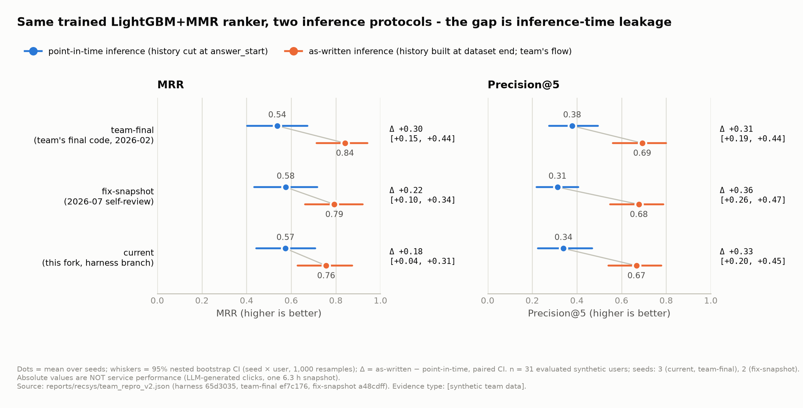
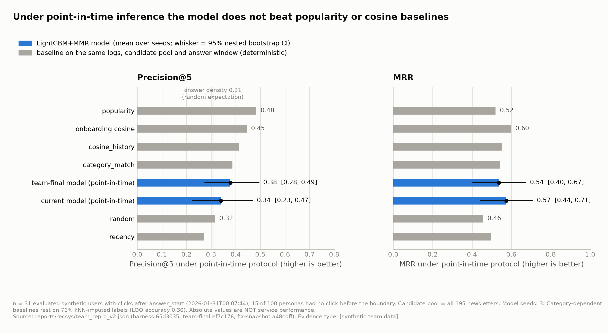

# 팀이 보고한 MRR 0.897은 왜 부풀려졌나 — 추천 평가 누수 재현과 프로토콜 재설계

| | |
|---|---|
| 작성 | 2026-09-26 |
| 증거 유형 | **[synthetic team data]** — 팀이 아카이브한 LLM 생성 합성 클릭 로그 위의 화이트박스 진단. 어떤 절대 수치도 실서비스 성능이 아니다. |
| 1차 출처 | `reports/recsys/team_repro_v2.{md,json}`, `docs/adr/0007-recsys-offline-evaluation-protocol.md` (브랜치 `eval/team-baseline-repro-v1`, 커밋 `1585ce6`; main 병합 PR 대기) |
| 검토 상태 | 어드버서리얼 방법론 검토 2회. v1 리포트 "unsound" → 재작성 → v2 리포트 "sound-with-caveats". 2차 검토가 남긴 수정 사항은 [8절](#8-한계와-남은-수정-사항)에 정리했고, 이 문서는 2차 검토가 안전하다고 판정한 주장만 사실로 적는다. |
| 그림·수치 재생성 | `python docs/portfolio/scripts/make_01_figures.py` → `img/`, `data/01-evaluation-leakage-numbers.json` |

**Abstract.** In a five-person Naver Boostcamp AI Tech 8 capstone (an LLM-generated, personalized Korean newsletter service), the team reported MRR 0.897 for its LightGBM+MMR recommender. Months after the project ended, working alone in my fork, I built a file-backed replay harness that runs the recommender unchanged from three git snapshots against the archived synthetic click logs, with git SHAs, data hashes and per-version configs pinned. The replay exposed inference-time leakage: user-history features were computed at the end of the dataset, so they already contained the validation clicks being scored, and with point-in-time inference MRR fell from 0.76 to 0.57 (current code) and from 0.84 to 0.54 (team-final code) on 31 evaluated synthetic users and 3 seeds. Under the corrected protocol the model did not beat a popularity baseline (P@5 0.34 vs 0.48), so I withdrew my own earlier conclusion that it did. Two adversarial methodology reviews, the first of which judged my v1 analysis unsound, shaped the final protocol, now recorded as ADR 0007. Everything here is a white-box diagnosis on LLM-generated synthetic clicks; none of the absolute numbers is service performance.

---

## 요약

1. 팀 최종 보고치 MRR 0.897은 **추론 시점 누출**(유저 히스토리 피처를 데이터셋 끝 시각에 계산 → 채점 대상 클릭이 피처에 포함)과 **학습 구간을 덮는 정답 창**(`NOW()-6일`)이 겹친 흐름에서 나왔다. 전자는 정량화했고, 후자는 코드로 확인했으나 정량 귀속은 하지 않는다.
2. 같은 학습된 모델을 추론 방식만 바꿔 비교하면, MRR이 current 0.7565 → 0.5741, team-final 0.8407 → 0.5372로 내려간다(n=31 유저, 3 시드, 시드×유저 nested bootstrap 95% CI가 0을 제외).
3. 누출을 걷어낸 뒤 모델은 popularity(P@5 0.4839)·onboarding cosine(0.4452) 베이스라인을 넘지 못한다(current P@5 0.3398). v1에서 내가 썼던 "모델이 베이스라인보다 낫다"는 결론은 철회했다.
4. 이 경험을 오프라인 평가 프로토콜(ADR 0007)로 고정했다: point-in-time 추론, 공유 고정 정답 구간, inner-validation 조기 종료, 동일 저울의 베이스라인 병기, nested bootstrap, 정확도 주장은 공개 벤치마크에서만.

## 1. 배경: 팀 프로젝트와 내 역할

"AI 개인화 뉴스레터 추천 시스템"은 5인 팀의 부스트캠프 최종 프로젝트다(팀 작업 종료 2026-02-10, git 태그 `team-final`). 뉴스 RSS를 수집·클러스터링해 LLM이 뉴스레터를 쓰고, 유저 클릭 이력으로 LightGBM+MMR 추천기가 순위를 매긴다.

팀에서 내 담당은 LangGraph 생성 워크플로우, HDBSCAN 클러스터링, 크롤링, LLM 프롬프트, Airflow였다(README "팀 소개" 표 기준). **추천 모델은 팀원 성승우, 합성 클릭 데이터셋과 백엔드/DB는 이선진**을 비롯한 다른 팀원의 작업이다. 이 문서가 다루는 추천기와 데이터는 내가 만든 것이 아니며, 내가 한 일은 팀이 끝난 뒤(2026-09-25부터) 단독 fork에서 그 결과물을 **재현하고 검증**한 것이다.

팀이 최종 보고(Notion)에 적은 추천 성능은 MRR 0.897, Precision@5 0.798, nDCG@5 0.801, Coverage@5 0.408이었다(유저 103명, 로그 14,784건, 뉴스레터 405건; `reports/recsys/team_repro_v1.md` 1절, team-final `recommend_engine/docs/USER GUIDE.md:71`). 팀 스스로 "과제가 너무 쉬운 것 아닌가" 의심했고 멘토도 같은 지적을 했지만, 원인은 규명되지 않은 채 끝났다.

## 2. 질문

> 0.897은 무엇을 측정한 숫자인가? 평가 흐름의 어느 지점이 이 값을 만들었고, 그 지점을 고치면 모델은 단순 베이스라인과 비교해 어디에 서는가?

이 질문에 답하려면 팀 코드를 고치지 않고 그대로 돌릴 수 있어야 했다. 팀 DB는 이미 없고, 남은 것은 아카이브된 CSV/npy 파일과 세 시점의 코드였다.

## 3. 재현 하네스: 세 스냅샷을 파일 위에서 그대로 돌리기

`evaluation/recsys/team_repro/`는 팀 추천기의 실제 클래스(`FeatureEngineer`, `LGBMDataset`, `LGBMRanker`, MMR reranker, `Evaluator`)를 세 git 스냅샷에서 **수정 없이** import해 train → inference(MMR) → evaluate 흐름을 파일 아카이브 위에서 재생하는 하네스다.

| 스냅샷 | SHA | 의미 |
|---|---|---|
| `team-final` | `ef7c176` | 팀 최종 보고 당시 코드 |
| `fix-snapshot` | `a48cdff` | 2026-07 내 셀프 리뷰 수정본(FIX #4 히스토리 누출 수정, FIX #5 lambdarank 전환 포함) |
| `current` | `65d3035` | 하네스가 있는 브랜치의 현재 코드(실행 시점 SHA; 리포트 파일은 그 위의 `1585ce6`에서 재생성) |

설계에서 중요한 선택 세 가지:

- **버전별 서브프로세스 격리.** 세 버전이 같은 모듈 경로(`src.data.data_loader` 등)를 쓰므로 한 프로세스에서 함께 import하면 `sys.modules`가 충돌한다. `run_repro.py`가 버전마다 `pipeline.py`를 별도 프로세스로 띄운다.
- **재현성 고정.** 데이터 4개 파일의 sha256, 각 버전의 `config.yaml`을 그대로 읽은 해시, 하네스/엔진 git SHA를 결과 JSON에 기록하고 캐시 키에 넣는다. 2차 독립 검토에서 캐시 없이 재실행한 결과가 보고 수치와 소수점 4자리까지 일치했다.
- **`main_lgbm.py`의 CLI 레이어만 대체.** 그 레이어가 DB에 직접 붙는 지점(`get_db_max_timestamp()`, production 모드 INSERT)이 있어 파일 위에서 그대로 쓸 수 없었다. 나머지는 전부 팀 코드다.

아카이브 데이터의 구조(`team_repro_v2.md` 1절): 페르소나 100명, 뉴스레터 195건, 로그 19,500건(클릭 9,281건, 47.6%), 로그 구간 2026-01-30 19:26 ~ 01-31 01:42(약 6.3시간). **각 페르소나가 195건 전부를 정확히 한 번씩, 평균 약 61분의 세션 안에 봤다.**

## 4. 누수 메커니즘

### 4-1. 추론 시점 누출: 히스토리를 데이터셋 끝에서 계산

팀의 추론 흐름(`main_lgbm.py` `inference_pipeline`)은 기준 시각을 DB의 마지막 로그 시각으로 잡는다(`get_db_max_timestamp()`). 유저 히스토리 임베딩은 그 시각 이전의 모든 클릭으로 만들어지므로, 시간순 80/20 분할의 **검증 구간 클릭 — 즉 채점할 정답 — 이 피처 안에 들어간다.** team-final의 `build_user_profiles`는 시간 필터가 아예 없고, FIX #4 이후 코드의 `compute_history_embedding`은 cutoff 인자를 받지만 cutoff 자체가 데이터셋 끝이라 결과는 같다. 내 v1 리포트도 이 흐름을 그대로 따라갔고, 1차 검토가 이를 BLOCKER로 잡았다.

v2 하네스는 이를 두 개의 로더로 분리한다. **1차(point-in-time)**: 로그 자체를 고정 정답 구간 시작 시각 `answer_start`(2026-01-31 00:07:44) 이전으로 물리적으로 잘라낸 두 번째 로더로 피처를 다시 계산해 추론한다 — cutoff 개념이 없는 team-final 코드에도 안전하다. **2차(as-written)**: 같은 학습된 모델을 팀 흐름대로(미제한 로그, 기준 시각 = 데이터셋 끝) 추론한다. 정답 구간은 동일하게 두어 **추론 시점 누출 하나만** 분리한다. 학습은 두 행 모두 `answer_start` 이전 로그만 쓰고, 조기 종료는 학습 구간을 다시 나눈 inner-validation으로 한다.

### 4-2. 정답 창이 학습 구간을 덮음

team-final의 실제 평가 스크립트 `scripts/evaluate_results.py:49-57`은 정답을 `created_at >= NOW() - INTERVAL '6 DAYS'`인 모든 행으로 정의한다(`is_clicked` 필터 없음, "전체 28일 중 20% ≈ 6일"이라는 주석). 로그가 6일보다 짧으면 이 창은 **학습 구간을 포함한 로그 전체**다. 이 아카이브(6.3시간)에서는 문자 그대로 전체 로그가 정답이 된다.

다만 v2 리포트의 "team-final-as-written" 행(MRR 1.0000)은 이 정의를 그대로 재현하느라 모든 행을 정답으로 세어 **퇴화**했다 — recall@5가 정확히 5/195 = 0.0256인 것이 그 증거로, 이 정의에서는 무작위 순위도 MRR 1.0을 찍는다. 2차 검토가 이를 BLOCKER로 지적했고, 클릭만 정답으로 세는 정의로 다시 계산하는 수정이 대기 중이다. 그래서 이 문서는 정답 창 문제를 "코드에서 확인된, 보고치를 부풀릴 수 있는 그럴듯한 요인"으로만 적고, **0.897을 정량적으로 설명했다고 주장하지 않는다.** 팀의 103명/405건 스냅샷 자체는 재현할 수 없다.

### 4-3. 데이터 구조가 누출을 증폭

각 페르소나가 약 1시간 세션 안에 전부를 봤으므로, 전역 시간순 80/20 분할은 사실상 **유저 단위 분할**이다. `answer_start` 이후 클릭이 있어 평가되는 유저 31명 중 15명은 경계 이전 클릭이 하나도 없는 cold 유저다 — as-written 추론에서 이들의 "히스토리"는 정답 그 자체다. 정답 밀도도 높아 무작위 추천의 P@5 기대값이 0.3072(실측 random 베이스라인 0.3161)다.

## 5. 결과

### 5-1. 추론 시점 누출 효과

<picture>
  <source media="(prefers-color-scheme: dark)" srcset="img/01-fig1-inference-leak-dark.png">
  
</picture>

*그림 1. 같은 학습된 ranker를 두 방식으로 추론한 결과. 점 = 시드 평균, 수염 = 시드×유저 nested bootstrap 95% CI(1,000회), Δ = as-written − point-in-time의 paired CI. [synthetic team data], n=31 유저, 시드 3(fix-snapshot 2).*

| 코드 버전 | 시드 | MRR point-in-time [95% CI] | MRR as-written [95% CI] | Δ MRR [95% CI] | Δ P@5 [95% CI] |
|---|---|---|---|---|---|
| team-final | 3 | 0.5372 [0.4029, 0.6728] | 0.8407 [0.7135, 0.9409] | +0.3035 [+0.1549, +0.4415] | +0.3140 [+0.1914, +0.4388] |
| fix-snapshot | 2 | 0.5750 [0.4337, 0.7167] | 0.7930 [0.6619, 0.9197] | +0.2180 [+0.1011, +0.3401] | +0.3645 [+0.2645, +0.4710] |
| current | 3 | 0.5741 [0.4438, 0.7080] | 0.7565 [0.6290, 0.8729] | +0.1823 [+0.0350, +0.3060] | +0.3269 [+0.1978, +0.4517] |

세 버전 모두 같은 방향이고 구간이 0을 제외한다. v1에서 내가 "team-final(0.849)이 current(0.772)보다 낫다"고 적었던 차이는 **point-in-time 추론에서는 나타나지 않는다**(2차 검토의 paired 재계산 −0.04 [−0.18, +0.09]; "누출이 주된 원인"이라는 인과 표현은 근거가 약해 쓰지 않는다).

### 5-2. 누출을 걷어낸 뒤: 모델 vs 베이스라인

<picture>
  <source media="(prefers-color-scheme: dark)" srcset="img/01-fig2-baselines-dark.png">
  
</picture>

*그림 2. point-in-time 프로토콜에서 모델(파랑, 95% CI)과 동일 로그·후보 풀·정답 구간의 베이스라인(회색). 세로선은 무작위 추천의 P@5 기대값(정답 밀도 0.31).*

| 방법 (point-in-time, 후보 195건) | MRR | Precision@5 |
|---|---|---|
| random | 0.4566 | 0.3161 |
| recency | 0.4980 | 0.2710 |
| popularity | 0.5200 | **0.4839** |
| category_match | 0.5427 | 0.3871 |
| cosine_history | 0.5540 | 0.4129 |
| onboarding newsletter cosine | **0.5985** | 0.4452 |
| team-final 모델 | 0.5372 ± 0.0567 | 0.3785 ± 0.0426 |
| current 모델 | 0.5741 ± 0.0582 | 0.3398 ± 0.0707 |

current 모델의 P@5는 popularity보다 낮다(2차 검토의 paired 재계산: −0.14 [−0.29, −0.01]; 리포트 v2 표에는 아직 이 paired CI가 없어 다음 개정에 추가한다). MRR은 popularity·onboarding cosine·cosine_history 어느 것과도 구별되지 않는다. cold/warm으로 나누면 popularity의 cold 유저 P@5는 0.7200(n=15), warm은 0.2625(n=16)로, 이 데이터에서 점수를 끌어올리는 것은 개인화가 아니라 cold 유저의 높은 정답 밀도다.

학습 진단도 함께 봐야 한다. current의 lambdarank 모델은 `best_iteration`이 시드별 [35, 1, 1], 고유 점수 개수가 [2983, 30, 28]이다 — **3개 시드 중 2개는 트리 한 개짜리 모델**이고 순위 대부분이 동점 처리다. inner-validation으로 바꿔도 이 붕괴는 사라지지 않았다.

### 5-3. 분해 실험 중 결론을 내리지 못한 것

| 실험 (current, point-in-time) | Δ MRR [95% CI] | 해석 |
|---|---|---|
| FIX #4 학습 시점 히스토리 누출 수정 (fixed → leaky) | −0.0345 [−0.1478, +0.0666] | 효과 검출 안 됨. n=31, 3 시드, 2 시드가 단일 트리 → **검정력 부족**. "효과 0"으로 읽지 않는다. |
| objective lambdarank → binary | +0.0194 [−0.0912, +0.1326] | 구별 불가. lambdarank 쪽이 단일 트리라 해석 자체가 불가. |

## 6. 살아남지 못한 주장

두 차례 검토를 거치며 내가 v1에 썼거나 쓰려 했던 다음 주장은 모두 폐기했다.

- **"LightGBM+MMR 모델이 베이스라인보다 낫다(MRR 0.77 vs 0.60)."** 비교가 불공정했다 — 베이스라인은 경계 이전 클릭만 썼고 모델 피처에는 정답이 들어 있었다.
- **"FIX #4/#5가 MRR을 0.849에서 0.772로 낮췄다."** point-in-time에서 그 차이는 사라진다.
- **"팀 최종을 그대로 재현하면 MRR 1.0으로 0.897에 근접한다."** 정답 정의가 퇴화해 어떤 순위도 1.0이다(4-2절).
- **"FIX #4 효과는 0에 가깝다(null)."** 구간이 [−0.15, +0.07]이고 모델이 덜 학습돼 결론 불가.
- **후보 풀 결론 일체.** `padded_400`(−0.19)은 학습 negative까지 바꿔 단일 트리 시드가 만든 값이고, `small_recent_15`(+0.03)는 서로 다른 정답 집합을 비교했다.
- **"노출 negative가 랜덤 negative보다 나쁘다/낫다."** 모든 페르소나가 전부를 봤으므로 두 negative는 같은 모집단이다.
- **"모델이 처음 보는(cold) 뉴스레터에 일반화된다."** `generator_split`의 검증 아이템은 정확히 가장 새로운 44건이라 recency만으로 MRR 0.6733이 나온다.
- **`label_assumption`(전체 행을 클릭으로) 실험.** 모든 유저가 195건을 "클릭"한 것이 되어 negative가 0개, 모델이 상수 — 실험 자체를 제거했다.
- **"캐시 키가 오래된 결과 재사용을 원천 차단한다."** HEAD SHA만 쓰므로 커밋 안 된 수정을 잡지 못한다.
- 이 스냅샷의 어떤 절대 MRR/P@5/nDCG/Coverage 값도 성능으로 인용하지 않는다.

## 7. 새 프로토콜: ADR 0007

검토에서 드러난 문제 하나하나를 결정으로 바꿨다(`docs/adr/0007-recsys-offline-evaluation-protocol.md`).

| 문제 (v1이 실제로 한 것) | 결정 |
|---|---|
| 추론 기준 시각 = 데이터셋 끝 | **point-in-time 추론을 1차 프로토콜**로. 로그를 `answer_start` 이전으로 물리적으로 잘라 피처를 다시 계산. 팀 흐름은 "as-written(leaky)" 2차 행으로만 남김 |
| 실행마다 80% 지점을 따로 계산해 정답 구간이 시드별로 몇 초씩 드리프트 | 모든 arm/시드/버전이 **공유하는 고정 정답 구간 하나** |
| 모델만 보고 상대 개선 주장 | random/popularity/recency/category_match/cosine_history/onboarding cosine을 **같은 로그·후보 풀·정답 구간으로 필수 병기**, cold/warm과 seen-filtered 변형 포함. 넘지 못하면 "낫다"고 쓰지 않음 |
| 정답 구간을 조기 종료 검증셋으로 재사용 | 학습 구간 내부 **inner-validation**만. `best_iteration`과 고유 점수 개수를 항상 기록 |
| 유저만 재표본한 bootstrap | **시드×유저 nested bootstrap**, n(유저·시드)과 다중비교 보정 여부 명시 |
| 합성 아카이브로 절대 성능 주장 | **정확도 주장은 공개 벤치마크(EB-NeRD 1차, MIND 보조)에서만.** 합성 스냅샷은 코드 결함의 방향·크기를 보는 진단 도구 |
| fix-snapshot을 하드코딩 binary로 실행 | 각 버전의 `config.yaml`을 **그대로 읽고 해시를 기록** |
| 캐시 키 = 실행 태그 | 하네스+엔진 SHA와 config 해시를 키에 포함 (dirty tree 미감지는 남은 한계) |

이것은 프로세스 결정이며 성능 결과가 아니다. 후속 EB-NeRD 평가(별도 사례 연구, 진행 중)는 이 프로토콜을 전제로 설계됐다.

## 8. 한계와 남은 수정 사항

**데이터의 한계**
- 클릭은 100개 LLM 페르소나에서 LLM이 추론해 만든 라벨이다. `category_match` 같은 명시적 신호와 순환성이 있을 수 있고, 세션이 6.3시간이라 신선도(half-life 7일) 피처는 사실상 죽어 있다.
- 평가 유저 n=31, 시드 3(fix-snapshot 2), 스냅샷 하나(100명/195건). 팀 보고 스냅샷(103명/405건)과 규모가 다르다.
- 카테고리 라벨 195건 중 148건(76%)이 BGE-M3 kNN 추정이고 LOO 정확도 0.2979(Wilson 95% CI [0.1865, 0.4398], 7개 카테고리, best-of-9 k라 낙관적). 카테고리 의존 지표의 절대값은 신뢰하지 않는다.
- 리포트는 20개가 넘는 신뢰구간을 병기하지만 다중비교 보정을 하지 않았다. 개별 구간 하나로 "유의"를 말하지 않고 방향과 크기의 패턴으로 읽어야 한다.

**방법의 한계 (2차 검토 지적, 반영 대기)**
- team-final-as-written 행을 클릭만 정답으로 다시 계산하고 같은 정의의 random 행을 병기.
- 단일 트리 시드의 동점 처리 민감도(동점을 무작위로 깨서 평균) 보고, `best_iteration=1` 시드를 퇴화로 표시, 분해 실험을 binary objective에서도 반복.
- 모델의 cold/warm·seen-filtered 값과 모델−베이스라인 paired CI를 표에 추가.
- nested bootstrap이 모델을 공유하는 두 arm의 시드를 독립 재표본해 보수적임(paired-seed 재계산 시 구간이 더 좁아짐)을 명시.
- ADR 0007의 시드 수 오기("3개 시드 모두 동일" → fix-snapshot은 2), 증거 절의 자리표시자, 퇴화한 as-written 행 인용, 캐시 "원천 차단" 표현을 수정.
- 학습 쪽에도 정답 창 정보가 일부 남아 있음(negative sampler의 제외 집합이 전체 로그를 봄; 검토자 측정으로는 효과 검출 안 됨) — 문서에 명시.

## 9. 이 사례에서 말할 수 있는 것 / 말하지 않는 것

**말할 수 있는 것**
- 팀원이 소유한 LightGBM+MMR 추천기를 세 git 스냅샷에서 수정 없이 재생하는 파일 기반 하네스를 만들고, SHA·데이터 해시·버전별 config 해시를 고정해 시드 재실행이 보고 수치를 소수점 4자리까지 재현하게 했다.
- 추론 시점 누출을 찾아 정량화했다: point-in-time 추론으로 MRR 0.76→0.57(current), 0.84→0.54(team-final), P@5는 0.31~0.36 하락(n=31 합성 유저, 3 시드).
- 누출을 고친 뒤 모델이 단순 베이스라인을 넘지 못함을 확인하고 **내 v1 결론을 철회**했다.
- 오프라인 평가 프로토콜을 ADR로 제정했다(프로세스 결정).

**말하지 않는 것**
- 0.897을 재현했다, 설명했다, 정량적으로 귀속했다.
- 팀이 무엇을 잘못 귀속했다 — FIX #4/#5는 팀이 아니라 내가 나중에 넣은 수정이고, 팀은 절대 지표만 보고했다.
- 추천 모델을 만들었거나 소유했다.
- 이 합성 데이터의 어떤 수치가 실서비스 성능이다.

## 10. 재현 방법과 출처

```bash
# 리포트가 있는 브랜치 (main 병합 전)
git fetch origin && git switch eval/team-baseline-repro-v1        # 1585ce6
# 하네스 실행 (팀 아카이브 data/team_archive 필요, gitignored)
python evaluation/recsys/team_repro/run_repro.py
python evaluation/recsys/team_repro/make_report_v2.py             # -> reports/recsys/team_repro_v2.{md,json}
# 이 문서의 그림과 수치 발췌
python docs/portfolio/scripts/make_01_figures.py --report reports/recsys/team_repro_v2.json
```

| 수치 | 출처 |
|---|---|
| 팀 보고치 0.897 / 0.798 / 0.801 / 0.408, 103명/14,784건/405건 | `reports/recsys/team_repro_v1.md` 1절; team-final `ai_workspace/recommend_engine/docs/USER GUIDE.md:71-73` |
| 데이터 구조, 정답 구간, cold/warm, 정답 밀도 | `team_repro_v2.json` `data_structure`; `team_repro_v2.md` 1절 |
| point-in-time / as-written 값과 CI, 누출 효과 | `team_repro_v2.json` `headline_ci`; `team_repro_v2.md` 2-1절 |
| 베이스라인, cold/warm | `team_repro_v2.json` `baselines.team_split`; `team_repro_v2.md` 3-1·3-2절 |
| best_iteration, 고유 점수 개수 | `team_repro_v2.json` `headline.*.primary_summary` |
| 분해 실험 CI | `team_repro_v2.json` `decomposition_bootstrap`; `team_repro_v2.md` 4절 |
| as-written 정답 정의 | team-final `ai_workspace/recommend_engine/scripts/evaluate_results.py:49-57`, `main_lgbm.py:20,99-129` |
| FIX #4 / #5 내용 | `docs/fix-log-2026-07.md` 4·5절 |
| paired 재계산(−0.14 [−0.29, −0.01], −0.04 [−0.18, +0.09]) | 2차 어드버서리얼 검토 결과(2026-09-26, 리포트 v2 미반영 — 다음 개정에 표로 추가) |

발췌본 `data/01-evaluation-leakage-numbers.json`에 위 수치와 SHA·데이터 해시가 함께 들어 있다.
